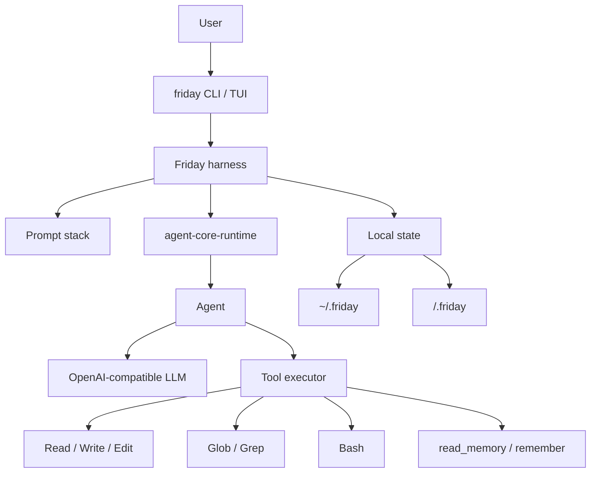

# Friday

[中文说明](README.zh-CN.md)

Friday is a personal CLI agent built with two pieces:

- `agent-core-runtime`: the lightweight runtime for `Agent`, tool calling, streaming, and run context.
- Friday harness: the local prompt stack, memory files, project instructions, and CLI tools that turn the runtime into a useful coding assistant.

The point of this repo is not the terminal skin. The point is showing how a real personal agent can be assembled on top of a small core runtime without depending on a large agent framework.

## Architecture



## Harness

Friday builds the model context in a stable order for prefix caching:

1. `soul.md`: durable identity and operating rules.
2. Runtime/tool guidance: how the available tools should be used.
3. `user.md`: personal preferences.
4. `AGENTS.md`: project-level instructions.
5. Environment notes: workspace, platform, shell.
6. Memory: global and project memory.

Global files live under `~/.friday`. Project state lives under `<workspace>/.friday`.

## Tools

Friday ships with a small default tool set:

- `Read`: read a line window from a file.
- `Write`: overwrite a file.
- `Edit`: edit by line range or exact text match.
- `Bash`: run shell commands. On Windows this uses PowerShell.
- `Glob`: find files by path pattern.
- `Grep`: search file contents.
- `read_memory` / `remember`: inspect and update durable memory.

## Install

```powershell
uv sync
Copy-Item .env.example .env
```

Fill `.env`:

```text
LLM_API_KEY=...
LLM_BASE_URL=https://api.deepseek.com
LLM_MODEL=deepseek-v4-flash
```

Install the command:

```powershell
uv tool install -e .
```

## Commands

```powershell
friday init
friday ask "summarize this project"
friday chat
friday tui
friday memory
friday reset
```

Use `friday --no-stream ...` to disable streaming. `friday reset` clears both project state and global Friday state after confirmation.

## Validate

```powershell
uv run python -m unittest discover -s tests
uv run python -m compileall src tests
```
