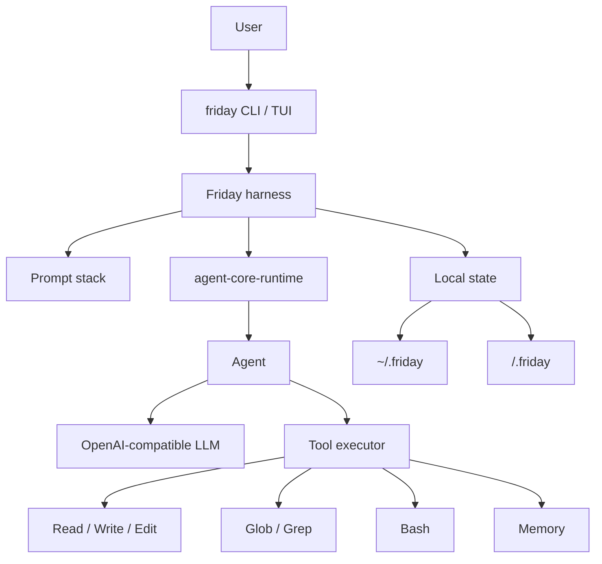

# Friday

[中文说明](README.zh-CN.md)

Friday is a personal CLI agent built with two pieces:

- `agent-core-runtime`: the lightweight runtime for `Agent`, tool calling, streaming, and run context.
- Friday harness: the local prompt stack, memory files, project instructions, and CLI tools that turn the runtime into a useful coding assistant.

The point of this repo is showing how a real personal agent can be assembled on top of a small core runtime without depending on a large agent framework.

## Features

- Workspace-aware by default: run `friday` from any directory and that directory becomes the agent workspace.
- Harness-first context design: identity, user profile, durable memory, project rules, and environment notes are layered in a stable order for prefix caching.
- Agent-as-router: the startup prompt stays small while project files, nested instructions, memory, and tools are pulled in only when needed.
- Plug-in skills: reusable `SKILL.md` workflows are discovered from project and home skill folders, then loaded on demand.
- Layered memory: user, global, and project memory are separate from disposable conversation compaction.
- Dangerous shell approval: destructive Bash commands are blocked until the user runs `/approve`.
- Session resume: recent `.friday/sessions` turns can be restored; `/resume` in the TUI lets you pick one.
- Small tool surface: file read/write/edit, shell, glob, grep, and memory cover the core coding loop without a large framework.
- Local state: project state lives in `<workspace>/.friday`; user state lives in `~/.friday`.

## Architecture



## Harness

Friday builds the model context in a stable order for prefix caching:

1. `SOUL.md`: who Friday is.
2. Runtime and tool guidance.
3. `USER.md`: who the user is and how they prefer to work.
4. Global `MEMORY.md`: cross-project facts and durable experience.
5. `AGENTS.md`: project instructions.
6. Environment notes: workspace, platform, shell.
7. Project `.friday/MEMORY.md`: project decisions and local context.

Bundled default files live in `src/friday/prompt_templates/`. They are copied to `~/.friday/` by `friday init`; runtime uses the editable home files.

Large project instruction files are truncated in the startup prompt. Nested `AGENTS.md` files are loaded lazily when Friday touches files in that directory, and each nested file is only injected once per session.

## Memory

Friday separates memory by purpose:

- `SOUL.md`: Friday's identity and operating style.
- `USER.md`: stable user profile and preferences.
- `~/.friday/MEMORY.md`: global memory across projects.
- `<workspace>/.friday/MEMORY.md`: memory for the current project only.
- `AGENTS.md`: project rules, not memory.

The `Memory` tool can `read`, `add`, `replace`, or `remove` entries. Writes hit disk immediately, but the startup prompt is a frozen snapshot; new memory naturally appears in the next session.

`/compact` first asks Friday to save only durable facts with the `Memory` tool, then summarizes the live conversation into a fresh context. The compact summary itself is disposable session state and is not written as memory.

## Skills

Friday discovers reusable `SKILL.md` workflows from `.friday/FridaySkills/<skill>/SKILL.md` and `~/.friday/FridaySkills/<skill>/SKILL.md`.

Only skill names and descriptions enter the startup prompt. The full `SKILL.md` is loaded through the `Skill` tool only when relevant.

## Tools

Friday ships with a small default tool set:

- `Read`: read a line window from a file.
- `Write`: overwrite a file.
- `Edit`: edit by line range or exact text match.
- `Bash`: run shell commands. On Windows this uses PowerShell. Destructive commands require approval.
- `Glob`: find files by path pattern.
- `Grep`: search file contents.
- `Skill`: list or read reusable `SKILL.md` workflows.
- `Memory`: read or update user, global, or project memory.

## Install

```powershell
uv sync
Copy-Item .env.example .env
cd ui-tui
npm install
cd ..
```

Fill `.env`:

```text
LLM_API_KEY=...
LLM_BASE_URL=https://api.deepseek.com
LLM_MODEL=deepseek-v4-flash
```

Install the command globally when ready:

```powershell
uv tool install -e .
```

For local development on Windows, this repo also includes `friday.cmd`. Put the repo directory on `PATH`, or call it by full path, and it will run Friday against your current directory.

## Usage

```powershell
friday
friday init
friday ask "summarize this project"
friday resume
friday approve
friday reject
friday memory
friday reset
```

Bare `friday` starts the terminal agent in the current directory. `friday reset` clears both project state and global Friday state after confirmation.

## Validate

```powershell
uv run python -m unittest discover -s tests
uv run python -m compileall src tests
```
