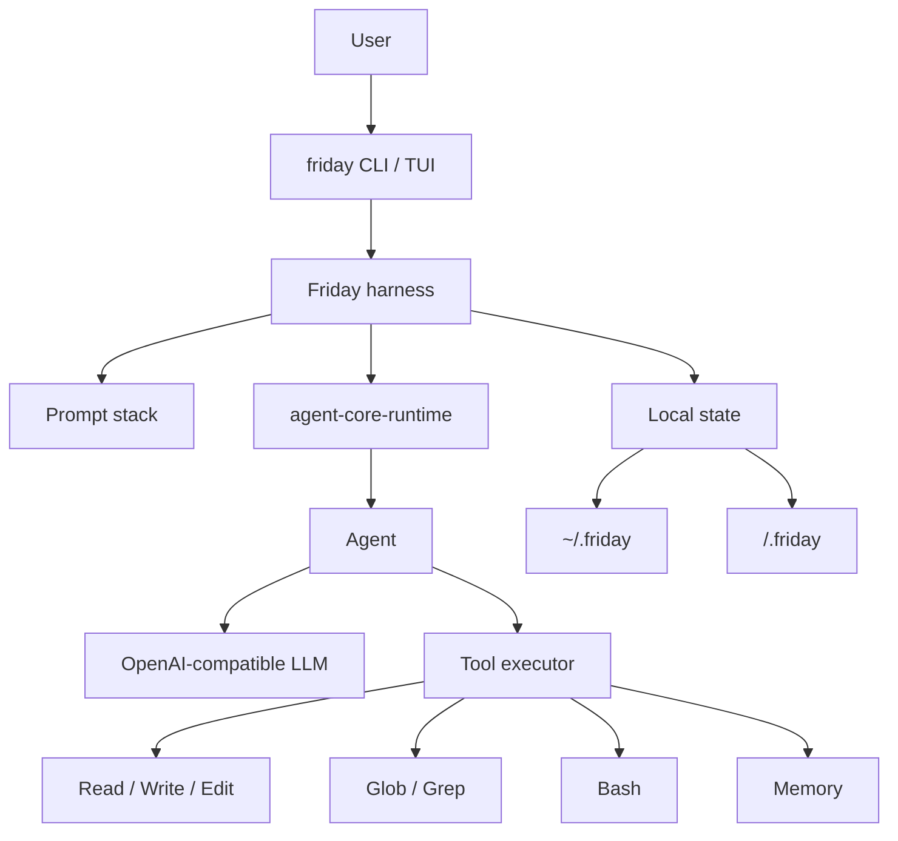

# Friday

[中文说明](README.zh-CN.md)

Friday is a personal CLI agent built with two pieces:

- `agent-core-runtime`: the lightweight runtime for `Agent`, tool calling, streaming, and run context.
- Friday harness: the local prompt stack, memory files, project instructions, and CLI tools that turn the runtime into a useful coding assistant.

The point of this repo is showing how a real personal agent can be assembled on top of a small core runtime without depending on a large agent framework.

## Architecture



## Harness

Friday builds the model context in a stable order for prefix caching:

1. `SOUL.md`: who Friday is.
2. Runtime and tool guidance.
3. `USER.md`: who the user is and how they prefer to work.
4. Global `MEMORY.md`: cross-project facts and durable experience.
5. `AGENTS.md`: project instructions.
6. Environment notes: workspace, platform, shell.
7. Project `.friday/MEMORY.md`: project decisions and local context.

Bundled default files live in `src/friday/prompt_templates/`. They are copied to `~/.friday/` by `friday init`; runtime uses the editable home files.

## Memory

Friday separates memory by purpose:

- `SOUL.md`: Friday's identity and operating style.
- `USER.md`: stable user profile and preferences.
- `~/.friday/MEMORY.md`: global memory across projects.
- `<workspace>/.friday/MEMORY.md`: memory for the current project only.
- `AGENTS.md`: project rules, not memory.

The `Memory` tool can `read`, `add`, `replace`, or `remove` entries. Writes hit disk immediately, but the startup prompt is a frozen snapshot; new memory naturally appears in the next session.

## Tools

Friday ships with a small default tool set:

- `Read`: read a line window from a file.
- `Write`: overwrite a file.
- `Edit`: edit by line range or exact text match.
- `Bash`: run shell commands. On Windows this uses PowerShell.
- `Glob`: find files by path pattern.
- `Grep`: search file contents.
- `Memory`: read or update user, global, or project memory.

## Install

```powershell
uv sync
Copy-Item .env.example .env
```

Fill `.env`:

```text
LLM_API_KEY=...
LLM_BASE_URL=https://api.deepseek.com
LLM_MODEL=deepseek-v4-flash
```

Install the command:

```powershell
uv tool install -e .
```

## Commands

```powershell
friday init
friday ask "summarize this project"
friday chat
friday tui
friday memory
friday reset
```

Use `friday --no-stream ...` to disable streaming. `friday reset` clears both project state and global Friday state after confirmation.

## Validate

```powershell
uv run python -m unittest discover -s tests
uv run python -m compileall src tests
```
