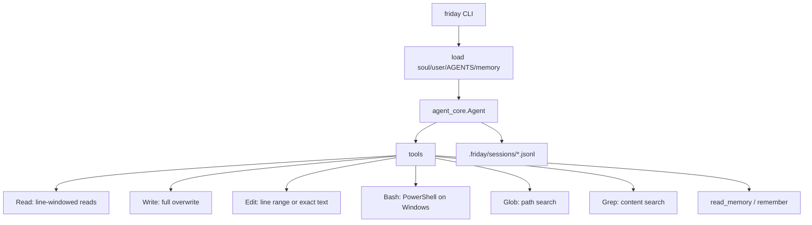

# Friday

[中文说明](README.zh-CN.md)

Friday is a personal CLI agent built on `agent-core-runtime`.

It is intentionally small: one user, one machine, local files, local memory, and OpenAI-compatible models through the core runtime.

## Shape



## Install

```powershell
uv sync
Copy-Item .env.example .env
```

`agent-core-runtime` is pulled automatically from GitHub; no sibling local repo is required.

Fill `.env`:

```text
LLM_API_KEY=...
LLM_BASE_URL=https://api.deepseek.com
LLM_MODEL=deepseek-v4-flash
```

Install the `friday` command:

```powershell
uv tool install -e .
```

## Use

```powershell
friday init
friday ask "summarize this project"
friday chat
friday tui
friday memory
friday reset
```

LLM output streams by default. Use `--no-stream` before the command:

```powershell
friday --no-stream ask "hello"
```

Inside `friday chat`, use slash commands:

- `/help`
- `/memory`
- `/reset`
- `/exit`

`friday reset` deletes both:

- project runtime state: `<workspace>/.friday`
- global Friday state: `~/.friday`

It asks for confirmation. Use `friday reset --yes` only when you are sure.

## Files

- `~/.friday/soul.md`: Friday's base personality and operating rules.
- `~/.friday/user.md`: your personal preferences.
- `~/.friday/MEMORY.md`: global memory.
- `AGENTS.md`: project instructions, compatible with Codex-style project guidance.
- `.friday/MEMORY.md`: project memory.
- `.friday/sessions/*.jsonl`: local chat logs.

Bundled defaults live in `src/friday/prompts/` and are copied to `~/.friday/` by `friday init`.

## Tools

- `Read(path, start_line=1, line_count=120, max_chars=6000)`
- `Write(path, content)` overwrites the whole file.
- `Edit(path, replacement, start_line=0, end_line=0, old_text="")` edits a line range, inserts when `end_line=0`, or replaces one exact text match.
- `Bash(command, timeout_seconds=60, max_chars=8000)` runs in the workspace. On Windows it uses PowerShell.
- `Glob(pattern, max_results=200)` finds paths.
- `Grep(pattern, path_glob="**/*", max_results=100, max_chars=240)` searches text file contents.

## Validate

```powershell
uv run python -m unittest discover -s tests
uv run python -m compileall src tests
```
