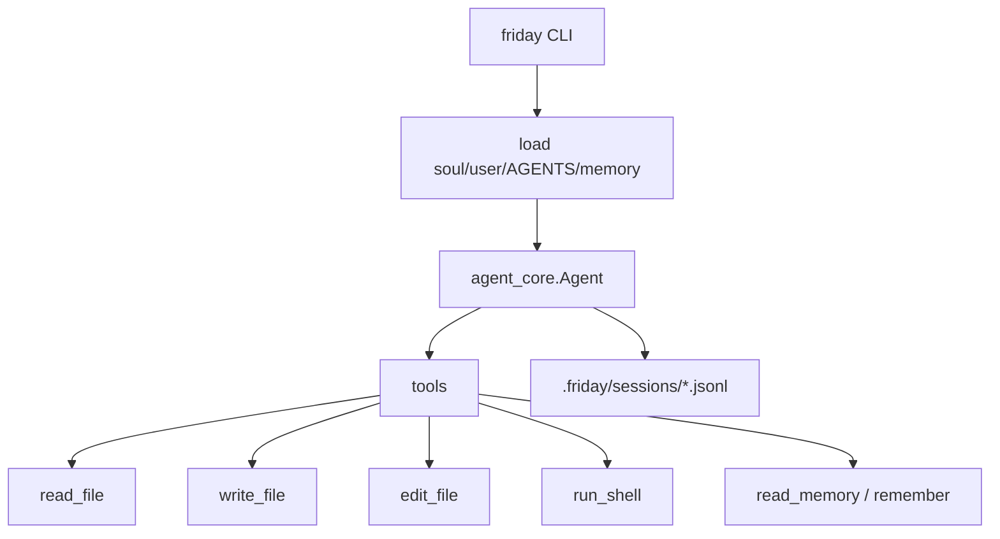

# Friday

[中文说明](README.zh-CN.md)

Friday is a personal CLI agent built on `agent-core-runtime`.

It is intentionally small: one user, one machine, local files, local memory, and OpenAI-compatible models through the core runtime.

## Shape



## Install

```powershell
uv sync
Copy-Item .env.example .env
```

Fill `.env`:

```text
LLM_API_KEY=...
LLM_BASE_URL=https://api.deepseek.com
LLM_MODEL=deepseek-v4-flash
```

Install the `friday` command:

```powershell
uv tool install -e .
```

## Use

```powershell
friday init
friday ask "summarize this project"
friday chat
friday memory
friday reset
```

LLM output streams by default. Use `--no-stream` before the command:

```powershell
friday --no-stream ask "hello"
```

Inside `friday chat`, use slash commands:

- `/help`
- `/memory`
- `/reset`
- `/exit`

## Files

- `src/friday/prompts/soul.md`: Friday's base personality and operating rules.
- `~/.friday/user.md`: your personal preferences.
- `~/.friday/MEMORY.md`: global memory.
- `AGENTS.md`: project instructions, compatible with Codex-style project guidance.
- `.friday/MEMORY.md`: project memory.
- `.friday/sessions/*.jsonl`: local chat logs.

## Validate

```powershell
uv run python -m unittest discover -s tests
uv run python -m compileall src tests
```
