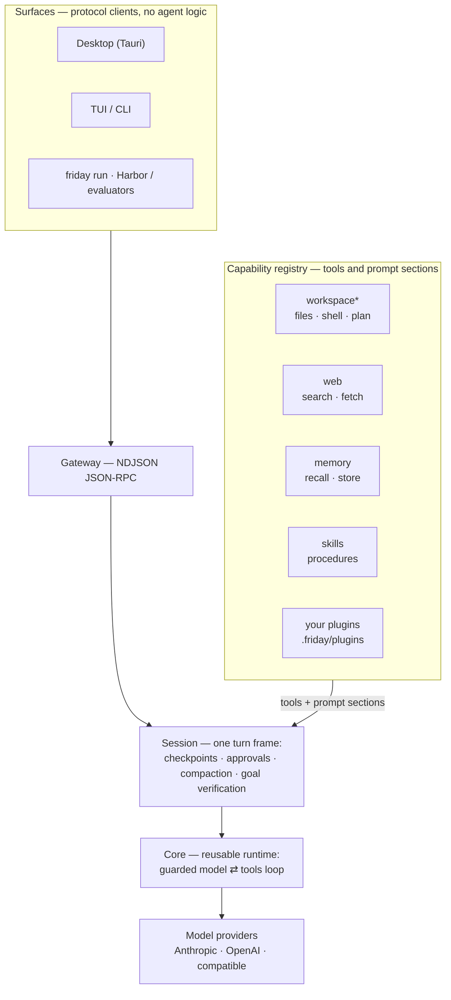

# Friday

<p align="center">
  
</p>

<p align="center">
  A local-first agent for real work, available as a desktop app, terminal UI, and headless evaluation runtime.
</p>

<p align="center">
  <a href="https://github.com/Lancetwang/friday/actions/workflows/typescript.yml"></a>
  <a href="https://www.npmjs.com/package/friday-agent"></a>
  <a href="https://github.com/Lancetwang/friday/releases"></a>
  <a href="LICENSE"></a>
</p>

<p align="center">
  <a href="README.zh-CN.md">简体中文</a> ·
  <a href="docs/quick-start.md">Quick start</a> ·
  <a href="docs/index.md">Documentation</a> ·
  <a href="https://github.com/Lancetwang/friday/releases">Downloads</a>
</p>

Friday works inside a local workspace: it reads and edits files, runs commands, searches the web, and carries a task through validation. Conversations, project state, credentials, memory, checkpoints, and traces remain on your machine under `~/.friday/`.

The project is a TypeScript monorepo with one runtime shared by every surface. The desktop app and TUI are clients of the same Harness; headless evaluations invoke that same path rather than a reduced benchmark-only agent.

Local-first does not mean offline: model requests and enabled web tools send the content needed for a task to the providers you configure. Friday does not operate a hosted account or synchronization backend.

## Why Friday

- **One agent across desktop and terminal.** Use a native desktop app for daily work, a keyboard-first TUI in any shell, or `friday run` in an isolated evaluator.
- **Long tasks have structure.** Persistent sessions, explicit plans, resumable progress, context compaction, and Goal mode's independent verification loop keep work moving without hiding the state transition.
- **Local state is inspectable.** Project data is stored outside the project tree, credentials are separated from sessions and traces, and the UI exposes tool activity, usage, compaction, and verification evidence.
- **Execution has enforceable boundaries.** Workspace-scoped file tools, hard command denials, configurable approvals, secret redaction, and verifier command filtering are implemented in code rather than left only to prompting.
- **The core is reusable.** [`friday-agent-core`](https://www.npmjs.com/package/friday-agent-core) is a small public model/tool loop with no Friday UI, persistence, memory, or product dependencies.

## Install

Choose the surface that fits your workflow:

| Surface | Install | Start | Requirements |
| --- | --- | --- | --- |
| Desktop | Download from [GitHub Releases](https://github.com/Lancetwang/friday/releases) | Launch Friday | Windows x64, macOS Apple Silicon, or Debian/Ubuntu x64 |
| TUI + CLI | `npm install --global friday-agent` | `friday` | Node.js 22 or newer |
| Agent Core | `npm install friday-agent-core` | Import from TypeScript/JavaScript | Node.js 22 or newer |

Desktop installers contain the complete runtime. End users do not need Git, Python, Node.js, Bun, or Rust.

After launch, configure a provider in **Settings → Models** or with `/login` in the TUI. Friday supports OpenAI, Anthropic, DeepSeek, Xiaomi MiMo, OpenCode Go, and custom OpenAI-compatible endpoints.

See the [installation guide](docs/install.md) for platform notes, upgrades, source installation, and uninstall instructions.

## Quick start

Open a project directory in the desktop app, or start Friday from that directory:

```bash
cd path/to/your-project
friday
```

Then ask for an outcome, for example:

```text
Find the cause of the failing tests, fix it, and verify the result.
```

Run one non-interactive turn without opening the TUI:

```bash
friday ask "Summarize this repository and explain how to test it."
```

Run a task with independent goal verification:

```bash
friday goal "Fix the failing tests and verify the result."
```

Use the headless evaluation contract only inside an isolated environment:

```bash
friday run --cwd /workspace --json --trajectory /logs/trajectory.json -- "Complete the task"
```

`friday run` defaults to bypassing interactive approval while retaining hard denials. See [CLI commands](docs/cli.md) and [evaluations](docs/evaluation.md) for the complete contract.

## What it provides

### Task execution

Friday combines a guarded model/tool loop with workspace tools for reading, searching, editing, shell execution, web research, memory, skills, and planning. Tools explicitly marked parallel-safe can execute concurrently; built-in mutations remain ordered and auditable.

### Context, memory, and skills

Stable instructions precede volatile state for provider prefix caching. When the model context reaches 85% of its configured window, Friday replaces older dialogue with a structured summary and replays the largest complete recent tail within its target, retaining a minimum tail even if the target cannot be met; the full conversation remains available to the UI, resume, and forks. Durable facts, project knowledge, episodic recall, and live task progress are stored separately. Skills are discovered from compact metadata and loaded only when selected.

### Verification and recovery

Goal mode checks the deliverable through a separate verifier and can feed concrete failures back into another attempt. Checkpoints materialized before a mutating turn can restore changed files together with the conversation boundary and task progress without modifying the project's Git history or index.

### Observability

The trace workbench records model requests, tool calls and results, timing, provider token usage, context occupancy, compaction, approvals, and verification. Web evidence is linked to the turn that used it, and retrieved content remains outside the private control prefix.

## Architecture


```mermaid
flowchart TB
    subgraph Surfaces["Surfaces — protocol clients, no agent logic"]
        direction LR
        Desktop["Desktop (Tauri)"]
        TUI["TUI / CLI"]
        Headless["friday run · Harbor / evaluators"]
    end
    Surfaces --> Gateway["Gateway — NDJSON JSON-RPC"]
    Gateway --> Session["Session — one turn frame:<br/>checkpoints · approvals · compaction · goal verification"]
    subgraph Registry["Capability registry — tools and prompt sections"]
        direction LR
        Workspace["workspace*<br/>files · shell · plan"]
        Web["web<br/>search · fetch"]
        Memory["memory<br/>recall · store"]
        Skills["skills<br/>procedures"]
        External["your plugins<br/>.friday/plugins"]
    end
    Registry -- "tools + prompt sections" --> Session
    Session --> Core["Core — reusable runtime:<br/>guarded model ⇄ tools loop"]
    Core --> Providers["Model providers<br/>Anthropic · OpenAI · compatible"]
```

`*` required; every other plugin — built-in or yours — can be switched off in
the TUI (`/plugins`), desktop Settings, or `disabled_plugins`.

- `packages/core` contains the public `Agent`, `RunContext`, provider adapters, tool execution, events, usage, cancellation, and preflight contracts.
- `packages/harness` owns the Friday product: prompts, tools, model profiles, sessions, permissions, memory, skills, checkpoints, traces, and verification.
- `ui-tui` and `ui-desktop` are protocol clients. They do not contain another agent loop.
- `integrations/harbor` is a thin adapter for Harbor's Python custom-agent protocol; it installs and invokes the TypeScript package.

The design intentionally uses ordinary async control flow instead of a generic graph abstraction. Read the [architecture guide](docs/architecture.md) for runtime boundaries and security invariants.

## Evaluations

Friday exposes a process-level contract instead of coupling Core to one benchmark. `friday run` can emit an ATIF v1.7 trajectory containing model identity, tool calls, observations, the final answer, and available usage metrics.

The included Harbor adapter runs the npm-distributed Friday runtime on Terminal-Bench 2.1. See [Evaluations](docs/evaluation.md) for invocation and reproducibility guidance.

## Repository layout

```text
packages/core/          Reusable agent loop and provider adapters
packages/harness/       Friday runtime, state, tools, and gateway
ui-tui/                 Terminal UI and cross-platform CLI
ui-desktop/             React + Tauri desktop application
integrations/harbor/    Terminal-Bench / Harbor adapter
docs/                   User and architecture documentation
```

## Development

```bash
git clone https://github.com/Lancetwang/friday.git
cd friday
npm ci
npm test
npm run check
```

Desktop development additionally requires the stable Rust toolchain and platform-specific Tauri dependencies:

```bash
npm ci --prefix ui-desktop
npm run desktop
```

The CI matrix validates Core, Harness, CLI, desktop frontend, standalone sidecar, and Tauri bridge on Windows, macOS, and Linux. Tagged builds also produce all three desktop installers, package checksums, and tested npm tarballs.

## Documentation

- [Quick start](docs/quick-start.md)
- [Installation](docs/install.md)
- [Model configuration](docs/model-configuration.md)
- [CLI reference](docs/cli.md)
- [Architecture](docs/architecture.md)
- [Tools and permissions](docs/tools.md)
- [Memory](docs/memory.md) and [Skills](docs/skills.md)
- [Verification](docs/verification.md) and [Checkpoints](docs/checkpoints.md)
- [Observability](docs/observability.md) and [Evaluations](docs/evaluation.md)
- [Changelog](CHANGELOG.md)

## Contributing

Issues and pull requests are welcome. Keep changes focused, preserve the Core/Harness boundary, and include the narrowest tests that demonstrate the behavior. Run `npm test` and `npm run check` before submitting; desktop changes should also pass `npm run build --prefix ui-desktop`.

For security-sensitive reports, avoid publishing credentials, traces, or private workspace contents in a public issue.

## License

Friday is available under the [MIT License](LICENSE).
