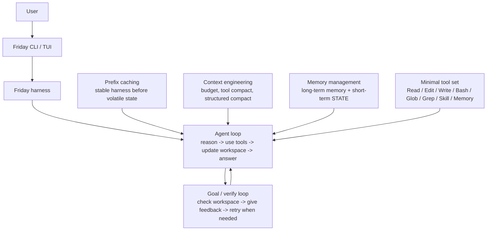

# Friday

[中文说明](README.zh-CN.md)

Friday is a local CLI coding agent. Run `friday` in a workspace, then ask it to read files, edit code, run commands, remember project facts, and verify changes.

It uses `agent-core-runtime` for agent execution and adds a Friday harness for prompts, memory files, permissions, context compaction, verifier loops, skills, and the terminal UI. Project state lives in `.friday/`; user state lives in `~/.friday/`.

## Features

- Workspace-aware by default: run `friday` from any directory and that directory becomes the agent workspace.
- Harness-first context design: runtime rules, skill catalog, user profile, memory, project rules, and environment notes are layered in a stable order for prefix caching.
- Agent-as-router: the startup prompt stays small while project files, nested instructions, memory, and tools are pulled in only when needed.
- Project rule layers: `AGENTS.md` is cross-agent guidance; `FRIDAY.md` is Friday-specific guidance; local variants stay private.
- Plug-in skills: reusable `SKILL.md` workflows are discovered from project and home skill folders, then loaded on demand.
- Layered memory: user, global, and project memory are separate from short-term task state and disposable conversation compaction.
- Multi-stage context compression: large tool results are compacted first; LLM conversation compact is kept for cases where tool compaction is not enough.
- Automatic verification loop: turns that change deliverables are checked by an independent verifier agent, with one repair attempt on failure.
- Goal mode: `/goal <task>` repeats main-agent attempts with verifier feedback until pass, blocked, or attempt limit.
- Context budget reporting: `/context` shows the current system prompt, skill catalog, tool schema, message, and tool-result footprint.
- Program-enforced Bash permissions: `.friday/permissions.json` provides persistent allow/deny/approval rules; `/approve` executes the pending command and feeds the result back into the same session.
- Session resume: recent `.friday/sessions` can be restored as session context; `/resume` in the TUI lets you pick one.
- Small tool surface: file read/write/edit, shell, glob, grep, and memory cover the core coding loop without a large framework.
- Local state: project state lives in `<workspace>/.friday`; user state lives in `~/.friday`.

## Architecture


```mermaid
flowchart TD
    User["User"] --> Friday["Friday CLI / TUI"]
    Friday --> Harness["Friday harness"]

    Harness --> AgentLoop["Agent loop<br/>reason -> use tools -> update workspace -> answer"]
    AgentLoop --> VerifyLoop["Goal / verify loop<br/>check workspace -> give feedback -> retry when needed"]
    VerifyLoop --> AgentLoop

    Prefix["Prefix caching<br/>stable harness before volatile state"] --> AgentLoop
    Context["Context engineering<br/>budget, tool compact, structured compact"] --> AgentLoop
    Memory["Memory management<br/>long-term memory + short-term STATE"] --> AgentLoop
    Tools["Minimal tool set<br/>Read / Edit / Write / Bash / Glob / Grep / Skill / Memory"] --> AgentLoop
```

## Harness

Friday builds the model context in a stable order for prefix caching:

1. `SOUL.md`: who Friday is.
2. Runtime instructions: tools, memory policy, project-rule discovery, skills, permissions, and context compaction.
3. Tool guidance.
4. Skill catalog: names and descriptions only.
5. `USER.md`: who the user is and how they prefer to work.
6. Global `MEMORY.md`: cross-project facts and durable experience.
7. Project instructions: `AGENTS.md`, `.friday/AGENTS.md`, `FRIDAY.md`, `.friday/FRIDAY.md`, `FRIDAY.local.md`, and `.friday/FRIDAY.local.md`.
8. Environment notes: workspace, platform, shell.
9. Project `.friday/MEMORY.md`: project decisions and local context.

Bundled default files live in `src/friday/prompt_templates/`. They are copied to `~/.friday/` by `friday init`; runtime uses the editable home files. `friday init` also creates project-local `FRIDAY.md`, `.friday/MEMORY.md`, and `.friday/permissions.json`.

Large project instruction files are truncated in the startup prompt. Nested `AGENTS.md` and `FRIDAY.md` instruction files are loaded lazily when Friday touches files in that directory, and each nested file is only injected once per session.

`.friday/STATE.md` is injected after the stable prompt as volatile short-term state, so updates do not invalidate the cached harness prefix.

## Memory

Friday separates memory by purpose:

- `SOUL.md`: Friday's identity and operating style.
- `USER.md`: stable user profile and preferences.
- `~/.friday/MEMORY.md`: global memory across projects.
- `<workspace>/.friday/MEMORY.md`: memory for the current project only.
- `<workspace>/.friday/STATE.md`: short-term task state for the current workspace.
- `AGENTS.md` and `FRIDAY.md`: project rules, not memory.

The `Memory` tool can `read`, `add`, `replace`, or `remove` entries. Writes hit disk immediately, but the startup prompt is a frozen snapshot; new memory naturally appears in the next session.

`/compact` first asks Friday to save only durable facts with the `Memory` tool, then compacts the live conversation into structured short-term state. The state is written to `.friday/STATE.md` and injected into the fresh context; it is not long-term memory.

## Context Management

Friday treats context as layers instead of one ever-growing prompt:

- Stable prefix: identity, runtime guidance, user profile, global memory, project instructions, environment, and project memory are assembled in a predictable order for prefix caching.
- Routed context: files, nested `AGENTS.md`, full skill bodies, and memory reads enter the conversation only when the agent asks for them.
- Tool compaction: when context usage reaches 85% of the configured window, oversized structured tool results are replaced with short summaries. If usage drops below 60%, the session keeps going without an LLM compact.
- Conversation compact: if tool compaction is not enough, Friday keeps the existing compact flow and first gives the agent a chance to save durable facts to memory.
- Short-term state: conversation compact uses a fixed schema for current goal, completed work, open items, tried methods, decisions, working files, command results, verification state, next steps, and recent conversations.
- Verification: after a turn changes deliverables, Friday runs an independent verifier against the workspace state and feeds failure feedback back to the main agent once.
- Goal loop: `/goal <task>` forces verification after each attempt and continues until the verifier passes, blocks with evidence, or reaches the attempt limit.
- Budget visibility: `/context` prints the current breakdown for system prompt, skill catalog, tool schemas, messages, and tool results.

The default context window is 128K tokens and can be overridden with `FRIDAY_CONTEXT_WINDOW`.

## Permissions

Friday separates persistent permissions from prompt rules:

- `.friday/permissions.json`: machine-readable Bash policy with `allow`, `deny`, and `require_approval` lists.
- `.friday/pending_approval.json`: one-shot pending approval written when a command needs user confirmation.
- `FRIDAY.md`: human-readable project guidance; it can mention the permission policy but does not enforce it.

Bash checks `permissions.json` before running. Deny rules block, allow rules run, approval rules create a pending approval, and the built-in dangerous-command heuristic remains the fallback. After approval, Friday records the executed command result in context and lets the agent produce the final user-facing reply.

## Skills

Friday discovers reusable `SKILL.md` workflows from `.friday/FridaySkills/<skill>/SKILL.md` and `~/.friday/FridaySkills/<skill>/SKILL.md`.

Only skill names and descriptions enter the startup prompt. The full `SKILL.md` is loaded through the `Skill` tool only when relevant.

## Tools

Friday ships with a small default tool set:

- `Read`: read a line window from a file.
- `Write`: overwrite a file.
- `Edit`: edit by line range or exact text match.
- `Bash`: run shell commands. On Windows this uses PowerShell. Destructive commands require approval.
- `Glob`: find files by path pattern.
- `Grep`: search file contents.
- `Skill`: list or read reusable `SKILL.md` workflows.
- `Memory`: read or update user, global, or project memory.

## Install

```powershell
uv sync
Copy-Item .env.example .env
cd ui-tui
npm install
cd ..
```

Fill `.env`:

```text
LLM_API_KEY=...
LLM_BASE_URL=https://api.deepseek.com
LLM_MODEL=deepseek-v4-flash
```

Install the command globally when ready:

```powershell
uv tool install -e .
```

For local development on Windows, this repo also includes `friday.cmd`. Put the repo directory on `PATH`, or call it by full path, and it will run Friday against your current directory.

## Usage

```powershell
friday
friday init
friday ask "summarize this project"
friday resume
friday approve
friday reject
friday chat   # then type /goal describe the task
friday memory
friday reset
```

Bare `friday` starts the terminal agent in the current directory. `friday reset` clears both project state and global Friday state after confirmation.

## Validate

```powershell
uv run python -m unittest discover -s tests
uv run python -m compileall src tests
```
