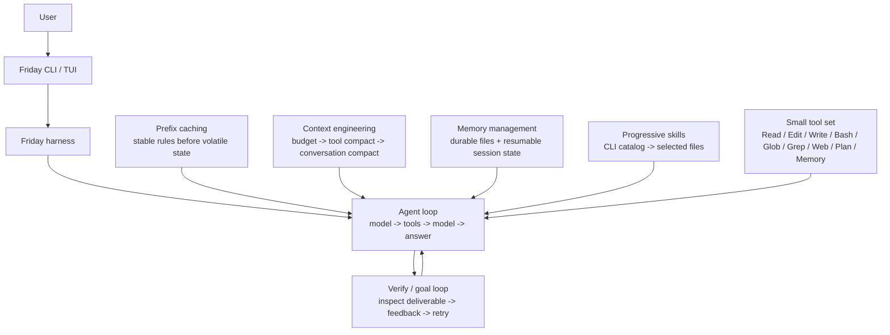

# Friday

[中文说明](README.zh-CN.md)

Friday is a local CLI coding agent. Run `friday` in any workspace to read and edit files, execute commands, search the web, retain project knowledge, and verify delivered changes.

It uses [agent-core-runtime](https://github.com/Lancetwang/agent-core-runtime) for generic agent execution. The Friday harness owns prompts, context compaction, memory, skills, permissions, verification and goal loops, sessions, traces, CLI, and TUI behavior.

## Install

```powershell
git clone https://github.com/Lancetwang/friday.git
cd friday
npm --prefix ui-tui ci
npm --prefix ui-tui run build
uv tool install -e . --force --reinstall
```

Put the API key in `~/.friday/.env` and model settings in `~/.friday/config.json`, then run `friday` from any project directory. See [Install](docs/install.md) for prerequisites, configuration, verification, upgrades, and uninstall steps.

## Features

- Workspace-aware startup: the directory where `friday` is launched becomes the active workspace.
- Layered model configuration: non-secret provider and token budgets live in global JSON with optional project overrides; credentials remain in `.env`.
- Harness-first context: stable runtime rules lead the prompt; user and project state are layered later for prefix caching.
- Agent-as-router: files, nested rules, skill bodies, and memory reads enter context only when needed.
- Layered rules: global `~/.friday/AGENTS.md` plus root and nested project `AGENTS.md` files.
- Progressive skills: the prompt keeps one CLI routing hint; `friday skill list --json` returns structured metadata and paths, then Bash reads only the selected `SKILL.md` and referenced resources.
- Layered memory: user profile, global memory, and project memory store durable facts; current progress remains an explicit resumable session snapshot.
- Visible progress: non-trivial work keeps one objective, structured plan, status, next action, and verifier state without splitting the conversation into task contexts.
- Multi-stage context compression: Friday first probes lossless tool-result simplification, then falls back to a structured summary plus the latest ten complete turns when the gain is insufficient.
- Completion-first turns: ordinary action requests continue through implementation and validation instead of stopping at a plan or partial result.
- Bounded web research: search repeats only for missing required evidence, and grounded answers cite retrieved sources while separating inference from facts.
- Independent verification: a verifier agent inspects the workspace without trusting the main agent's claims.
- Adaptive verification: simple deliverables receive the smallest sufficient independent check; concrete repairs can continue without a fixed attempt cap until a semantic stop.
- Goal mode: `/goal <task>` keeps the original objective pinned and requires verifier pass; it stops on blockage, insufficient evidence, repeated no-progress, approval, or Token Budget.
- Program-enforced permissions: dangerous Bash commands are stopped before execution and require explicit approval.
- Exact runtime accounting: provider usage is accumulated across main-agent and verifier calls, with marked estimates only when usage is unavailable.
- Local observability: model and tool events are flushed incrementally so timeouts remain diagnosable; completed turns also record a compact JSONL summary with prompt shape, verification, timing, usage, and result.
- Session resume: one atomic snapshot per session restores both the conversation and its current progress under a freshly rebuilt prefix.
- Compatible runtime upgrades: Friday pins a tested agent-core source and checks the isolated tool environment before a turn starts.

## Architecture


```mermaid
flowchart TD
    User["User"] --> Surface["Friday CLI / TUI"]
    Surface --> Harness["Friday harness"]

    Harness --> AgentLoop["Agent loop<br/>model -> tools -> model -> answer"]
    AgentLoop --> OuterLoop["Verify / goal loop<br/>inspect deliverable -> feedback -> retry"]
    OuterLoop --> AgentLoop

    Prefix["Prefix caching<br/>stable rules before volatile state"] --> AgentLoop
    Context["Context engineering<br/>budget -> tool compact -> conversation compact"] --> AgentLoop
    Memory["Memory management<br/>durable files + resumable session state"] --> AgentLoop
    Skills["Progressive skills<br/>CLI catalog -> selected files"] --> AgentLoop
    Tools["Small tool set<br/>Read / Edit / Write / Bash / Glob / Grep / Web / Plan / Memory"] --> AgentLoop
```

## Harness

Friday assembles the model prefix in this order:

1. `SOUL.md`: Friday's identity and purpose.
2. Bundled `RUNTIME.md`: outcomes, autonomy, evidence, memory boundaries, validation, and stopping conditions.
3. Bundled `TOOL_GUIDANCE.md`.
4. Global rules from `~/.friday/AGENTS.md`.
5. `~/.friday/USER.md` profile.
6. Global `~/.friday/MEMORY.md`.
7. One-line Skill discovery and on-demand routing guidance.
8. Root and nested project instructions.
9. Live environment details.
10. Project `.friday/MEMORY.md`.

Static system prompts are bundled Markdown files rather than Python string literals. This code-owned prefix stays first and changes only on upgrade. User layers follow it, while workspace-specific state stays near the tail. This preserves the largest useful provider-cache prefix without letting live paths or project state go stale.

Friday provisions missing global defaults and the bundled `friday-cli` skill under `~/.friday/`. `friday init` is intentionally project-scoped and creates only `AGENTS.md`; project memory, permissions, skills, sessions, and traces are created lazily.

## Memory

Friday separates facts, rules, and task state:

- `USER.md`: stable user profile and preferences.
- `~/.friday/MEMORY.md`: durable cross-project facts.
- `<workspace>/.friday/MEMORY.md`: durable project facts and decisions.
- `AGENTS.md`: operating rules, not memory.
- Live messages and session snapshots: current task state, not long-term memory.

The `Memory` tool can read, add, replace, or remove scoped entries. Before conversation compact, Friday asks the agent to save only durable facts, then emits a structured in-session summary for task continuity. Compact summaries and temporary progress never become long-term memory automatically.

## Context Management

- The default context window is 353K tokens and the default per-response output budget is 64K tokens; both are configurable globally or per project.
- At 85% usage, Friday probes oversized structured tool results.
- Tool results are simplified only when the lossless rewrite preserves every field and predicts at least 25% context gain.
- Otherwise Friday performs one in-band structured compact pass, preserving the existing prefix.
- The rebuilt context is the fresh prefix followed by the structured summary and the latest ten complete user turns verbatim, including paired assistant tool calls and tool results.
- `/context` separates system prompt, skill routing, tool schemas, messages, and tool results, and shows latest-turn provider usage when available.

## Upgrade

Friday and agent-core are upgraded together through Friday's pinned dependency:

```powershell
cd path\to\friday
git pull --ff-only
npm --prefix ui-tui ci
npm --prefix ui-tui run build
uv tool install -e . --force --reinstall
```

Do not independently upgrade agent-core inside the tool environment. If a newer core is not pinned by Friday yet, it has not been compatibility-tested for this agent. Friday checks the installed direct dependency against its current pin at startup and gives the reinstall command before any turn runs.

## Docs

- [Install](docs/install.md)
- [Quick Start](docs/quick-start.md)
- [Model Configuration](docs/model-configuration.md)
- [CLI Commands](docs/cli.md)
- [Tools](docs/tools.md)
- [Memory](docs/memory.md)
- [Skills](docs/skills.md)

## Validate

```powershell
uv run python -m unittest discover -s tests
uv run python -m compileall src tests
npm --prefix ui-tui run typecheck
```
