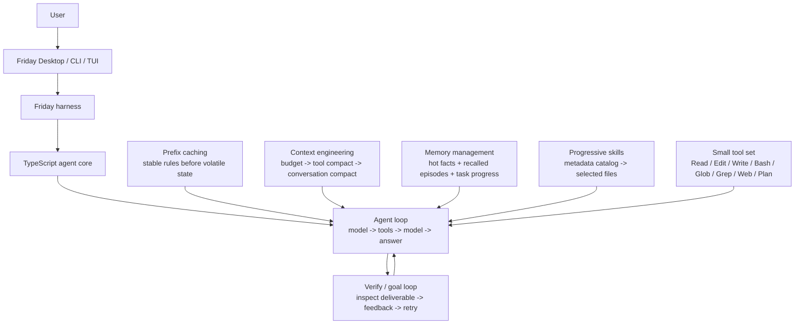

# Friday

<p align="center">
  
</p>

<p align="center">
  <a href="https://github.com/Lancetwang/friday/releases"></a>
  <a href="https://nodejs.org/"></a>
  <a href="https://www.npmjs.com/"></a>
  <a href="https://github.com/Lancetwang/friday/releases"></a>
  <a href="https://github.com/Lancetwang/friday/releases"></a>
  <a href="docs/install.md"></a>
  <a href="LICENSE"></a>
</p>

<p align="center"><a href="README.zh-CN.md">中文说明</a></p>

Friday is a local general-purpose agent available as a Windows, macOS, and Linux desktop app, plus a cross-platform TUI. It can work with files, execute commands, search the web, retain useful context, and carry tasks through verification.

The TypeScript monorepo contains a small reusable agent core and the Friday Harness. The Harness owns prompts, context compaction, memory, skills, permissions, verification and goal loops, sessions, traces, and UI behavior. [TypeScript migration](docs/typescript-migration.md) describes the boundary.

## Install

### Desktop App (Recommended)

Download the Windows x64 NSIS installer, macOS Apple Silicon DMG, or Linux x64 AppImage from the TypeScript workflow artifacts (and from [GitHub Releases](https://github.com/Lancetwang/friday/releases) once promoted). The packaged app contains a standalone TypeScript sidecar; Git, Python, Node.js, Bun, and Rust are not required.

Launch Friday, open **Settings > Models**, and configure at least one provider API key. Web search keys and user preferences can be configured from the same Settings page.

### npm

Install the complete Core + Harness + TUI package globally:

```bash
npm install --global friday-agent
friday
```

Install only the reusable core in another TypeScript project:

```bash
npm install friday-agent-core
```

The npm names are not published while the migration branch is under review.
Download the `Friday-npm-packages` artifact from the
[TypeScript workflow](https://github.com/Lancetwang/friday/actions/workflows/typescript.yml),
extract it, and install the already-packed artifact:

```bash
npm install --global ./friday-agent-0.2.0-alpha.0.tgz
friday
```

### From Source

```powershell
git clone https://github.com/Lancetwang/friday.git
cd friday
git switch codex/typescript-rewrite
npm ci
npm link
friday
```

Node.js 22 or newer is required for npm and source installs. npm creates the
platform shim, so `friday` is the command in PowerShell, cmd, bash, and zsh.

See [Install](docs/install.md) for both installation paths, prerequisites, configuration, upgrades, and uninstall steps.

## Features

- General-purpose execution: work with local files and commands, search the web, and continue ordinary tasks through delivery and validation.
- Two-layer loop: the agent loop handles model-tool interaction; the independent Verify / Goal loop checks deliverables and drives evidence-based repair.
- Prefix-aware context: stable runtime rules lead the prompt, while user, project, Skill, and recalled memory layers are disclosed only when needed.
- Multi-stage compaction: lossless tool-result simplification is probed first; structured conversation compaction keeps the largest complete recent tail that fits, up to ten user turns.
- Layered memory and progress: stable user facts, project knowledge, episodic recall, and resumable task progress remain separate.
- Progressive Skills: Friday routes on compact metadata first, then reads only the selected `SKILL.md` and referenced resources.
- Long-running task control: explicit objectives, plans, next actions, verifier state, semantic stop conditions, and session resume keep work on track.
- Turn checkpoints: desktop message restore recovers workspace files, conversation, and progress without touching the project's Git history.
- Tool lifecycle hooks: code-level permission preflight runs before execution, while a three-round sliding no-progress guard catches identical tool calls without constraining legitimate retries with changed arguments.
- Program-enforced permissions: hard-denied commands and explicit deny rules stop before execution; grey-area commands can be reviewed by the user or a separate intent reviewer.
- Checkpoint-derived deliverables: files actually changed by a turn are attached to its reply and safe document/image formats can be previewed locally.
- Prompt-injection boundary: private control context is protected across the main agent and auxiliary model calls, while retrieved content is treated as untrusted data.
- Bounded web research: search continues only for missing evidence, with retrieved sources separated from model inference.
- Exact accounting and traces: provider usage, model calls, tool activity, compaction, verification, and results are recorded for inspection and analysis.
- Evaluation contract: `friday run` provides headless sandbox execution and writes ATIF-v1.7 trajectories for Harbor, Terminal-Bench, and other harnesses.

## Architecture


```mermaid
flowchart TD
    User["User"] --> Surface["Friday Desktop / CLI / TUI"]
    Surface --> Harness["Friday harness"]
    Harness --> Core["TypeScript agent core"]

    Core --> AgentLoop["Agent loop<br/>model -> tools -> model -> answer"]
    AgentLoop --> OuterLoop["Verify / goal loop<br/>inspect deliverable -> feedback -> retry"]
    OuterLoop --> AgentLoop

    Prefix["Prefix caching<br/>stable rules before volatile state"] --> AgentLoop
    Context["Context engineering<br/>budget -> tool compact -> conversation compact"] --> AgentLoop
    Memory["Memory management<br/>hot facts + recalled episodes + task progress"] --> AgentLoop
    Skills["Progressive skills<br/>metadata catalog -> selected files"] --> AgentLoop
    Tools["Small tool set<br/>Read / Edit / Write / Bash / Glob / Grep / Web / Plan"] --> AgentLoop
```

## Docs

- [Docs Index](docs/index.md) — complete guide hub
- [Install](docs/install.md) ([中文](docs/install.zh-CN.md))
- [Changelog](CHANGELOG.md)
- [Quick Start](docs/quick-start.md) ([中文](docs/quick-start.zh-CN.md))
- [Architecture](docs/architecture.md)
- [Model Configuration](docs/model-configuration.md)
- [CLI Commands](docs/cli.md)
- [Tools](docs/tools.md)
- [Memory](docs/memory.md)
- [Skills](docs/skills.md)
- [Verification](docs/verification.md)
- [Evaluations](docs/evaluation.md)
- [Observability](docs/observability.md)
- [Checkpoints](docs/checkpoints.md)

## Validate

```powershell
npm ci
npm run check
npm test
npm ci --prefix ui-desktop
npm run build --prefix ui-desktop
```

## License

Friday is released under the [MIT License](LICENSE).
