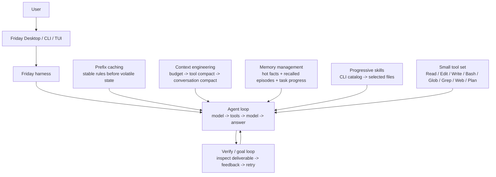

# Friday

[中文说明](README.zh-CN.md)

Friday is a local general-purpose agent available as a Windows desktop app, TUI, and CLI. It can work with files, execute commands, search the web, retain useful context, and carry tasks through verification.

It uses [agent-core-runtime](https://github.com/Lancetwang/agent-core-runtime) for generic agent execution. The Friday harness owns prompts, context compaction, memory, skills, permissions, verification and goal loops, sessions, traces, and desktop, CLI, and TUI behavior. [Architecture](docs/architecture.md) describes the boundary between the two.

## Install

### Windows App (Recommended)

Open [GitHub Releases](https://github.com/Lancetwang/friday/releases), download the newest Windows x64 setup executable (currently `Friday_0.1.0_x64-setup.exe`), and run it. The packaged app includes Friday and its Python runtime; Git, Python, Node.js, and Rust are not required.

Launch Friday, open **Settings > Models**, and configure at least one provider API key. Web search keys and user preferences can be configured from the same Settings page.

### From Source

```powershell
git clone https://github.com/Lancetwang/friday.git
cd friday
npm --prefix ui-tui ci
npm --prefix ui-tui run build
uv tool install -e . --force --reinstall
```

The source installation provides the global `friday` CLI and TUI. The checkout stays on disk, and all Python dependencies, including [`friday-agent-core`](https://pypi.org/project/friday-agent-core/), resolve automatically from PyPI.

See [Install](docs/install.md) for both installation paths, prerequisites, configuration, upgrades, and uninstall steps.

## Features

- General-purpose execution: work with local files and commands, search the web, and continue ordinary tasks through delivery and validation.
- Two-layer loop: the agent loop handles model-tool interaction; the independent Verify / Goal loop checks deliverables and drives evidence-based repair.
- Prefix-aware context: stable runtime rules lead the prompt, while user, project, Skill, and recalled memory layers are disclosed only when needed.
- Multi-stage compaction: lossless tool-result simplification is probed first; structured conversation compaction preserves the latest ten complete turns when required.
- Layered memory and progress: stable user facts, project knowledge, episodic recall, and resumable task progress remain separate.
- Progressive Skills: Friday lists metadata and paths first, then reads only the selected `SKILL.md` and referenced resources.
- Long-running task control: explicit objectives, plans, next actions, verifier state, semantic stop conditions, and session resume keep work on track.
- Turn checkpoints: `/undo` restores workspace files, conversation, and progress to the state before the latest Friday turn without touching the project's Git history.
- Program-enforced permissions: hard-denied commands and explicit deny rules stop before execution; grey-area commands can be reviewed by the user or a separate intent reviewer.
- Checkpoint-derived deliverables: files actually changed by a turn are attached to its reply and safe document/image formats can be previewed locally.
- Prompt-injection boundary: private control context is protected across the main agent and auxiliary model calls, while retrieved content is treated as untrusted data.
- Bounded web research: search continues only for missing evidence, with retrieved sources separated from model inference.
- Exact accounting and traces: provider usage, model calls, tool activity, compaction, verification, and results are recorded for inspection and analysis.
- Runtime compatibility: Friday pins a tested [`friday-agent-core`](https://pypi.org/project/friday-agent-core/) version and checks the installed environment before execution.

## Architecture


```mermaid
flowchart TD
    User["User"] --> Surface["Friday Desktop / CLI / TUI"]
    Surface --> Harness["Friday harness"]

    Harness --> AgentLoop["Agent loop<br/>model -> tools -> model -> answer"]
    AgentLoop --> OuterLoop["Verify / goal loop<br/>inspect deliverable -> feedback -> retry"]
    OuterLoop --> AgentLoop

    Prefix["Prefix caching<br/>stable rules before volatile state"] --> AgentLoop
    Context["Context engineering<br/>budget -> tool compact -> conversation compact"] --> AgentLoop
    Memory["Memory management<br/>hot facts + recalled episodes + task progress"] --> AgentLoop
    Skills["Progressive skills<br/>CLI catalog -> selected files"] --> AgentLoop
    Tools["Small tool set<br/>Read / Edit / Write / Bash / Glob / Grep / Web / Plan"] --> AgentLoop
```

## Docs

- [Install](docs/install.md) ([中文](docs/install.zh-CN.md))
- [Quick Start](docs/quick-start.md) ([中文](docs/quick-start.zh-CN.md))
- [Architecture](docs/architecture.md)
- [Model Configuration](docs/model-configuration.md)
- [CLI Commands](docs/cli.md)
- [Tools](docs/tools.md)
- [Memory](docs/memory.md)
- [Skills](docs/skills.md)
- [Observability](docs/observability.md)
- [Checkpoints](docs/checkpoints.md)

## Validate

```powershell
uv run python -m unittest discover -s tests
uv run python -m compileall src tests
npm --prefix ui-tui run typecheck
```
