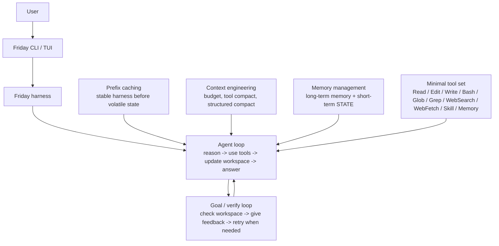

# Friday

[中文说明](README.zh-CN.md)

Friday is a local CLI coding agent. Run `friday` in a workspace, then ask it to read files, edit code, run commands, remember project facts, and verify changes.

It uses `agent-core-runtime` for agent execution and adds a Friday harness for prompts, memory files, permissions, context compaction, verifier loops, skills, and the terminal UI. Project state lives in `.friday/`; user state lives in `~/.friday/`.

Detailed usage docs live in [docs](docs/index.md).

## Features

- Workspace-aware by default: run `friday` from any directory and that directory becomes the agent workspace.
- Harness-first context design: runtime rules, skill catalog, user profile, memory, project rules, and environment notes are layered in a stable order for prefix caching.
- Agent-as-router: the startup prompt stays small while project files, nested instructions, memory, and tools are pulled in only when needed.
- Rule layers: `~/.friday/AGENTS.md` is your global cross-project rules; a project's `AGENTS.md` (root or nested) holds project rules and overrides the global file.
- Plug-in skills: reusable `SKILL.md` workflows are discovered from project and home skill folders, then loaded on demand.
- Layered memory: user, global, and project memory hold durable declarative facts; short-term task context lives in the session, not a persisted file.
- Multi-stage context compression: large tool results are compacted only when a cheap probe says the space gain is worth it; otherwise Friday goes straight to conversation compact.
- Automatic verification loop: turns that change deliverables are checked by an independent verifier agent, with one repair attempt on failure.
- Goal mode: `/goal <task>` repeats main-agent attempts with verifier feedback until pass, blocked, approval, or cancellation.
- Context budget reporting: `/context` shows local estimates for the system prompt, skill catalog, tool schemas, messages, and tool results, plus provider usage aggregated across every model call in the latest turn.
- Local traces: each turn writes a JSONL trace with a prompt summary, runtime timeline, tool calls, verification results, metrics, and final answer.
- Program-enforced Bash permissions: `.friday/permissions.json` provides persistent allow/deny/approval rules; `/approve` executes the pending command and feeds the result back into the same session.
- Session resume: each session keeps one snapshot file (`.friday/sessions/<id>.json`), overwritten in place; resume restores it under a freshly built prefix.
- Small tool surface: file read/write/edit, shell, glob, grep, web search/fetch, skills, and memory cover the core loop without a large framework.
- Local state: project state lives in `<workspace>/.friday`; user state lives in `~/.friday`.

## Architecture


```mermaid
flowchart TD
    User["User"] --> Friday["Friday CLI / TUI"]
    Friday --> Harness["Friday harness"]

    Harness --> AgentLoop["Agent loop<br/>reason -> use tools -> update workspace -> answer"]
    AgentLoop --> VerifyLoop["Goal / verify loop<br/>check workspace -> give feedback -> retry when needed"]
    VerifyLoop --> AgentLoop

    Prefix["Prefix caching<br/>stable harness before volatile state"] --> AgentLoop
    Context["Context engineering<br/>budget, tool compact, structured compact"] --> AgentLoop
    Memory["Memory management<br/>long-term memory + short-term STATE"] --> AgentLoop
    Tools["Minimal tool set<br/>Read / Edit / Write / Bash / Glob / Grep / WebSearch / WebFetch / Skill / Memory"] --> AgentLoop
```

## Harness

Friday builds the model context in a stable order for prefix caching:

1. `SOUL.md`: who Friday is.
2. Runtime instructions: tools, memory policy, project-rule discovery, skills, permissions, and context compaction.
3. Tool guidance.
4. Global rules: `~/.friday/AGENTS.md`, your cross-project operating rules for Friday.
5. `USER.md`: who the user is and how they prefer to work.
6. Global `MEMORY.md`: cross-project facts and durable experience.
7. Skill catalog: names and descriptions only.
8. Project instructions: `AGENTS.md` and `.friday/AGENTS.md`, discovered from the filesystem root down to the workspace.
9. Environment notes: workspace, OS, shell, Friday home, install path, permission mode.
10. Project `.friday/MEMORY.md`: project decisions and local context.

The global, code-owned prefix (steps 1-3) is identical across every workspace and changes only on upgrade, so it stays at the front for provider prefix caching. Global user layers (4-6) come next, then the workspace-specific tail (7-10). Environment notes are injected dynamically so the live OS and paths never go stale.

Prompt text lives in `src/friday/prompts.py`, so the harness modules reference it instead of embedding string literals. Bundled default document templates live in `src/friday/prompt_templates/`.

Friday provisions the global home on first run: any `friday` command ensures `~/.friday/` holds `SOUL.md`, `AGENTS.md`, `USER.md`, `MEMORY.md`, and a `FridaySkills/` folder (only missing files are created; runtime uses these editable home files). `friday init` is project-scoped and creates **only** the project's `AGENTS.md`; everything else a project uses (memory, permissions, skills, sessions) is unrelated to project rules and is created lazily by the runtime when first needed.

Large project instruction files are truncated in the startup prompt. Nested `AGENTS.md` instruction files are loaded lazily when Friday touches files in that directory, and each nested file is only injected once per session.

Short-term task state is not persisted to a file: it lives in the live conversation, is restored by `friday resume`, and is compacted into an in-session summary when context runs long.

## Memory

Friday separates memory by purpose:

- `SOUL.md`: Friday's identity and operating style.
- `USER.md`: stable user profile and preferences.
- `~/.friday/MEMORY.md`: global memory across projects.
- `<workspace>/.friday/MEMORY.md`: memory for the current project only.
- `~/.friday/AGENTS.md`: global rules Friday follows in every workspace, not memory.
- Project `AGENTS.md`: project rules, not memory.

The `Memory` tool can `read`, `add`, `replace`, or `remove` entries. Writes hit disk immediately, but the startup prompt is a frozen snapshot; new memory naturally appears in the next session.

`/compact` first asks Friday to save only durable facts with the `Memory` tool, then compacts the live conversation into a structured summary. The summary is injected back as an in-session message (saved by the next snapshot, restored by resume); it is not long-term memory.

## Context Management

Friday treats context as layers instead of one ever-growing prompt:

- Stable prefix: identity, runtime guidance, user profile, global memory, project instructions, environment, and project memory are assembled in a predictable order for prefix caching.
- Routed context: files, nested `AGENTS.md`, full skill bodies, and memory reads enter the conversation only when the agent asks for them.
- Tool compaction: when context usage reaches 85% of the configured window, Friday probes oversized structured tool results first. If compacting them would free at least 25% of the current context, it replaces them with short summaries.
- Conversation compact: if the tool probe is not worthwhile, Friday keeps the existing compact flow and first gives the agent a chance to save durable facts to memory.
- Short-term context: conversation compact uses a fixed schema (current goal, completed work, open items, tried methods, decisions, working files, command results, verification state, next steps, recent conversations) and keeps the result in the session instead of a file.
- Verification: after a turn changes deliverables, Friday runs an independent verifier against the workspace state and feeds failure feedback back to the main agent once.
- Goal loop: `/goal <task>` forces verification after each attempt and continues until the verifier passes, blocks with evidence, needs approval, or is cancelled.
- Budget visibility: `/context` prints the current breakdown for system prompt, skill catalog, tool schemas, messages, and tool results. Friday estimates the parts it builds locally and records input/output usage across all main-agent and verifier calls in the latest turn; provider values are used when available and clearly marked estimates are used otherwise.

The default context window is 128K tokens and can be overridden with `FRIDAY_CONTEXT_WINDOW`.

## Docs

- [Install](docs/install.md)
- [Quick Start](docs/quick-start.md)
- [CLI Commands](docs/cli.md)
- [Tools](docs/tools.md)
- [Memory](docs/memory.md)
- [Skills](docs/skills.md)

## Validate

```powershell
uv run python -m unittest discover -s tests
uv run python -m compileall src tests
```
