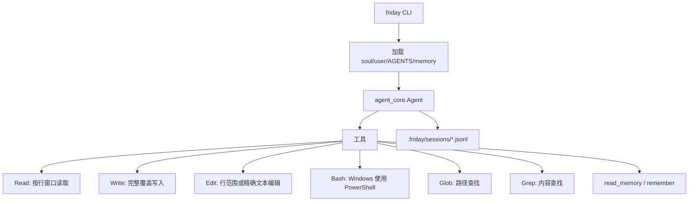

# Friday

[English README](README.md)

Friday 是一个基于 `agent-core-runtime` 的个人 CLI agent。

它不做多人系统，也不做平台化抽象：一个用户、一台机器、本地文件、本地记忆，通过 core runtime 调 OpenAI-compatible 模型。

## 结构



## 安装

```powershell
uv sync
Copy-Item .env.example .env
```

`agent-core-runtime` 会自动从 GitHub 下载，不需要本地放一个相邻的 core 仓库。

填写 `.env`：

```text
LLM_API_KEY=...
LLM_BASE_URL=https://api.deepseek.com
LLM_MODEL=deepseek-v4-flash
```

安装全局 `friday` 命令：

```powershell
uv tool install -e .
```

## 使用

```powershell
friday init
friday ask "summarize this project"
friday chat
friday tui
friday memory
friday reset
```

LLM 默认流式输出。关闭流式：

```powershell
friday --no-stream ask "hello"
```

在 `friday chat` 里可以使用斜杆命令：

- `/help`
- `/memory`
- `/reset`
- `/exit`

`friday reset` 会删除两类状态：

- 项目运行状态：`<workspace>/.friday`
- 全局 Friday 状态：`~/.friday`

它会先要求确认。确定要清空时可以用 `friday reset --yes`。

## 文件

- `~/.friday/soul.md`：Friday 的基础人格和运行规则。
- `~/.friday/user.md`：你的个人偏好。
- `~/.friday/MEMORY.md`：全局记忆。
- `AGENTS.md`：项目指令，兼容 Codex 风格的项目指导。
- `.friday/MEMORY.md`：项目记忆。
- `.friday/sessions/*.jsonl`：本地聊天日志。

内置默认模板在 `src/friday/prompts/`，`friday init` 会把它们复制到 `~/.friday/`。

## 工具

- `Read(path, start_line=1, line_count=120, max_chars=6000)`
- `Write(path, content)` 会覆盖整个文件。
- `Edit(path, replacement, start_line=0, end_line=0, old_text="")` 可以编辑行范围，`end_line=0` 时插入，也可以替换唯一匹配的精确文本。
- `Bash(command, timeout_seconds=60, max_chars=8000)` 在当前工作区运行命令。Windows 下使用 PowerShell。
- `Glob(pattern, max_results=200)` 查找路径。
- `Grep(pattern, path_glob="**/*", max_results=100, max_chars=240)` 搜索文本文件内容。

## 验证

```powershell
uv run python -m unittest discover -s tests
uv run python -m compileall src tests
```
