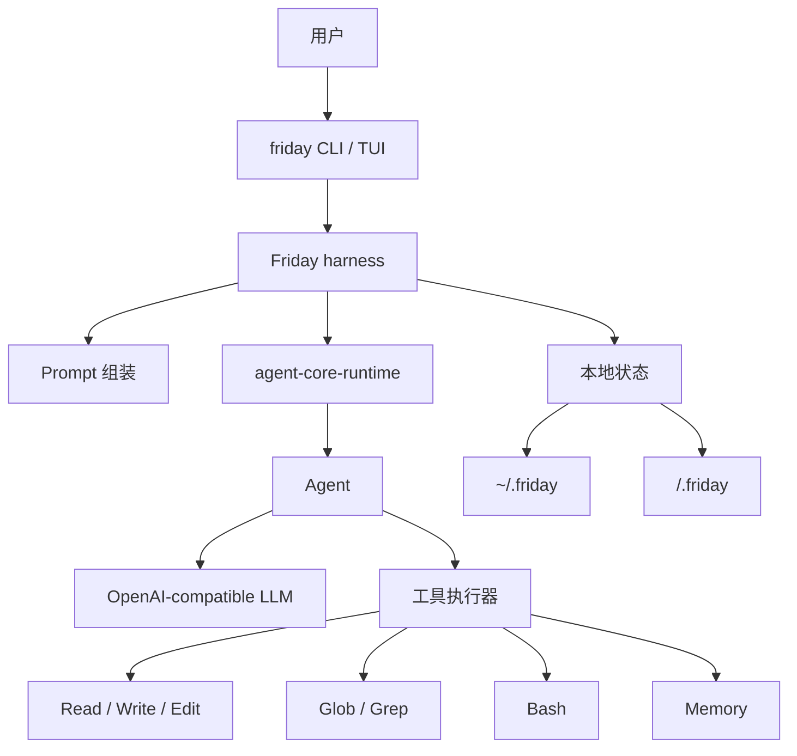

# Friday

[English README](README.md)

Friday 是一个个人 CLI agent，由两部分组成：

- `agent-core-runtime`：负责 `Agent`、工具调用、流式输出和运行上下文的轻量 runtime。
- Friday harness：负责本地 prompt 组装、记忆文件、项目指令和 CLI 工具，把 core runtime 变成一个可用的个人编码助手。

这个仓库的重点是展示如何基于一个很小的自研 core runtime，搭建一个真实可用的个人 agent，而不是依赖庞大的 agent 框架。

## 架构



## Harness

Friday 会按稳定顺序组装模型上下文，方便 prefix caching：

1. `SOUL.md`：Friday 是谁。
2. Runtime 和工具使用规则。
3. `USER.md`：用户是谁，以及用户偏好如何工作。
4. 全局 `MEMORY.md`：跨项目事实和长期经验。
5. `AGENTS.md`：项目指令。
6. 环境信息：工作区、平台、shell。
7. 项目 `.friday/MEMORY.md`：项目决策和本地上下文。

内置默认文件放在 `src/friday/prompt_templates/`。`friday init` 会把它们复制到 `~/.friday/`，运行时使用 home 目录下可编辑的文件。

## 记忆

Friday 按用途区分记忆：

- `SOUL.md`：Friday 的身份和工作风格。
- `USER.md`：稳定的用户画像和偏好。
- `~/.friday/MEMORY.md`：跨项目的全局记忆。
- `<workspace>/.friday/MEMORY.md`：只属于当前项目的记忆。
- `AGENTS.md`：项目规则，不是记忆。

`Memory` 工具可以 `read`、`add`、`replace` 或 `remove` 条目。写入会立刻落盘，但启动 prompt 是冻结快照；新的长期记忆会在下一次会话自然生效。

## 工具

Friday 默认提供一组小工具：

- `Read`：按行窗口读取文件。
- `Write`：覆盖写入文件。
- `Edit`：按行范围或精确文本匹配编辑文件。
- `Bash`：运行 shell 命令。Windows 下使用 PowerShell。
- `Glob`：按路径模式查找文件。
- `Grep`：搜索文件内容。
- `Memory`：读取或更新用户、全局、项目记忆。

## 安装

```powershell
uv sync
Copy-Item .env.example .env
```

填写 `.env`：

```text
LLM_API_KEY=...
LLM_BASE_URL=https://api.deepseek.com
LLM_MODEL=deepseek-v4-flash
```

安装命令：

```powershell
uv tool install -e .
```

## 命令

```powershell
friday init
friday ask "summarize this project"
friday chat
friday tui
friday memory
friday reset
```

使用 `friday --no-stream ...` 可以关闭流式输出。`friday reset` 会在确认后清空项目状态和全局 Friday 状态。

## 验证

```powershell
uv run python -m unittest discover -s tests
uv run python -m compileall src tests
```
