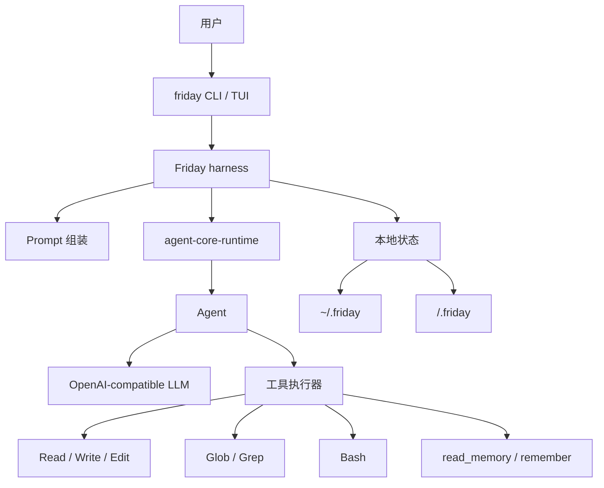

# Friday

[English README](README.md)

Friday 是一个个人 CLI agent，由两部分组成：

- `agent-core-runtime`：负责 `Agent`、工具调用、流式输出和运行上下文的轻量 runtime。
- Friday harness：负责本地 prompt 组装、记忆文件、项目指令和 CLI 工具，把 core runtime 变成一个可用的个人编码助手。

这个仓库的重点不是终端皮肤，而是展示如何基于一个很小的自研 core runtime，搭建一个真实可用的个人 agent，而不是依赖庞大的 agent 框架。

## 架构



## Harness

Friday 会按稳定顺序组装模型上下文，方便 prefix caching：

1. `soul.md`：稳定的人格和运行规则。
2. runtime/tool guidance：说明工具能力和使用方式。
3. `user.md`：用户偏好。
4. `AGENTS.md`：项目级指令。
5. 环境信息：工作区、平台、shell。
6. 记忆：全局记忆和项目记忆。

全局文件放在 `~/.friday`，项目状态放在 `<workspace>/.friday`。

## 工具

Friday 默认提供一组小工具：

- `Read`：按行窗口读取文件。
- `Write`：覆盖写入文件。
- `Edit`：按行范围或精确文本匹配编辑文件。
- `Bash`：运行 shell 命令。Windows 下使用 PowerShell。
- `Glob`：按路径模式查找文件。
- `Grep`：搜索文件内容。
- `read_memory` / `remember`：读取和更新长期记忆。

## 安装

```powershell
uv sync
Copy-Item .env.example .env
```

填写 `.env`：

```text
LLM_API_KEY=...
LLM_BASE_URL=https://api.deepseek.com
LLM_MODEL=deepseek-v4-flash
```

安装命令：

```powershell
uv tool install -e .
```

## 命令

```powershell
friday init
friday ask "summarize this project"
friday chat
friday tui
friday memory
friday reset
```

使用 `friday --no-stream ...` 可以关闭流式输出。`friday reset` 会在确认后清空项目状态和全局 Friday 状态。

## 验证

```powershell
uv run python -m unittest discover -s tests
uv run python -m compileall src tests
```
