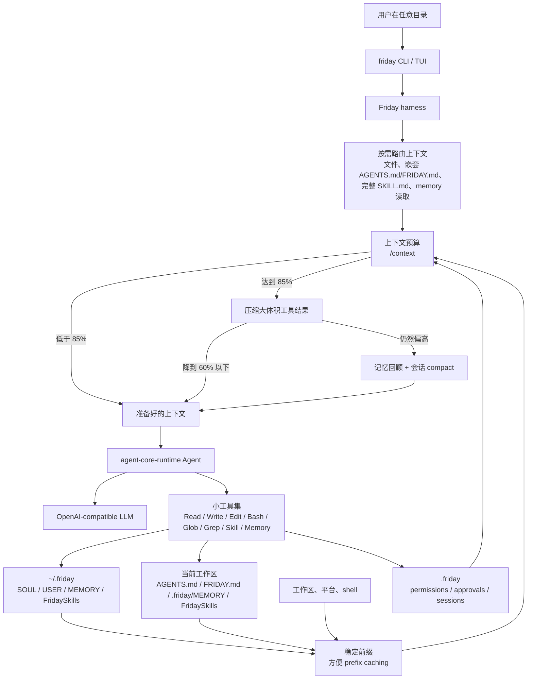

# Friday

[English README](README.md)

Friday 是一个个人 CLI agent，由两部分组成：

- `agent-core-runtime`：负责 `Agent`、工具调用、流式输出和运行上下文的轻量 runtime。
- Friday harness：负责本地 prompt 组装、记忆文件、项目指令和 CLI 工具，把 core runtime 变成一个可用的个人编码助手。

这个仓库的重点是展示如何基于一个很小的自研 core runtime，搭建一个真实可用的个人 agent，而不是依赖庞大的 agent 框架。

## 特性

- 默认感知工作区：在任意目录运行 `friday`，该目录就是 agent 的工作目录。
- Harness 优先的上下文设计：runtime 规则、skill 目录、用户画像、长期记忆、项目规则和环境信息按稳定顺序组装，方便 prefix caching。
- Agent 只做路由：启动 prompt 保持克制，项目文件、嵌套指令、记忆和工具按需进入上下文。
- 项目规则分层：`AGENTS.md` 是跨 agent 规则；`FRIDAY.md` 是 Friday 专属规则；local 变体保持本机私有。
- 即插即用 skills：从项目和 home 目录发现可复用的 `SKILL.md` 工作流，按需加载。
- 分层记忆：用户、全局、项目记忆彼此独立，和可丢弃的 compact 会话摘要分开。
- 多阶段上下文压缩：优先压缩大体积工具结果；只有工具压缩不够时，才触发 LLM 会话 compact。
- 上下文预算报告：`/context` 展示 system prompt、skill catalog、tool schema、messages、tool results 的当前占用。
- 程序执行的 Bash 权限：`.friday/permissions.json` 提供持久 allow、deny、approval 规则；一次性审批使用 `/approve`。
- 会话恢复：可以恢复最近 `.friday/sessions` 里的对话上下文；TUI 里的 `/resume` 会先列出来让你选。
- 小工具集：读写编辑文件、shell、glob、grep、memory 覆盖核心编码循环，不依赖庞大框架。
- 本地状态：项目状态在 `<workspace>/.friday`，用户状态在 `~/.friday`。

## 架构


```mermaid
flowchart TD
    User["用户在任意目录"] --> CLI["friday CLI / TUI"]
    CLI --> Harness["Friday harness"]

    Home["~/.friday<br/>SOUL / USER / MEMORY / FridaySkills"] --> Prefix["稳定前缀<br/>方便 prefix caching"]
    Project["当前工作区<br/>AGENTS.md / FRIDAY.md / .friday/MEMORY / FridaySkills"] --> Prefix
    Env["工作区、平台、shell"] --> Prefix
    Prefix --> Budget["上下文预算<br/>/context"]

    Harness --> Routed["按需路由上下文<br/>文件、嵌套 AGENTS.md/FRIDAY.md、完整 SKILL.md、memory 读取"]
    Routed --> Budget
    State[".friday<br/>permissions / approvals / sessions"] --> Budget

    Budget -->|"低于 85%"| Ready["准备好的上下文"]
    Budget -->|"达到 85%"| ToolCompact["压缩大体积工具结果"]
    ToolCompact -->|"降到 60% 以下"| Ready
    ToolCompact -->|"仍然偏高"| LLMCompact["记忆回顾 + 会话 compact"]
    LLMCompact --> Ready

    Ready --> Runtime["agent-core-runtime Agent"]
    Runtime --> LLM["OpenAI-compatible LLM"]
    Runtime --> Tools["小工具集<br/>Read / Write / Edit / Bash / Glob / Grep / Skill / Memory"]
    Tools --> State
    Tools --> Home
    Tools --> Project
```

## Harness

Friday 会按稳定顺序组装模型上下文，方便 prefix caching：

1. `SOUL.md`：Friday 是谁。
2. Runtime instructions：工具、memory policy、项目规则发现、skills、permissions 和上下文压缩机制。
3. Tool Guidance：工具使用偏好。
4. Skill Catalog：只放 skill 名称和描述。
5. `USER.md`：用户是谁，以及用户偏好如何工作。
6. 全局 `MEMORY.md`：跨项目事实和长期经验。
7. 项目指令：`AGENTS.md`、`.friday/AGENTS.md`、`FRIDAY.md`、`.friday/FRIDAY.md`、`FRIDAY.local.md` 和 `.friday/FRIDAY.local.md`。
8. 环境信息：工作区、平台、shell。
9. 项目 `.friday/MEMORY.md`：项目决策和本地上下文。

内置默认文件放在 `src/friday/prompt_templates/`。`friday init` 会把它们复制到 `~/.friday/`，运行时使用 home 目录下可编辑的文件。`friday init` 也会创建项目内的 `FRIDAY.md`、`.friday/MEMORY.md` 和 `.friday/permissions.json`。

过大的项目指令文件会在启动 prompt 中截断。嵌套目录里的 `AGENTS.md` 和 `FRIDAY.md` 会在 Friday 触达该目录文件时按需加载，并且每个嵌套文件每个 session 只注入一次。

## 记忆

Friday 按用途区分记忆：

- `SOUL.md`：Friday 的身份和工作风格。
- `USER.md`：稳定的用户画像和偏好。
- `~/.friday/MEMORY.md`：跨项目的全局记忆。
- `<workspace>/.friday/MEMORY.md`：只属于当前项目的记忆。
- `AGENTS.md` 和 `FRIDAY.md`：项目规则，不是记忆。

`Memory` 工具可以 `read`、`add`、`replace` 或 `remove` 条目。写入会立刻落盘，但启动 prompt 是冻结快照；新的长期记忆会在下一次会话自然生效。

`/compact` 会先让 Friday 用 `Memory` 工具保存真正值得长期保留的事实，然后把当前对话压缩到一个新的上下文里。compact 摘要本身只是可丢弃的会话状态，不会作为 memory 写入。

## 上下文管理

Friday 把上下文拆成几层，而不是把所有东西塞进一个不断增长的 prompt：

- 稳定前缀：身份、runtime 规则、用户画像、全局记忆、项目规则、环境信息、项目记忆按固定顺序组装，方便 prefix caching。
- 路由上下文：文件、嵌套 `AGENTS.md`、完整 skill 内容和 memory 读取结果，只有在 agent 需要时才进入对话。
- 工具压缩：当上下文占用达到窗口的 85% 时，先把大体积结构化工具结果替换成短摘要；如果压到 60% 以下，就不再额外调用 LLM compact。
- 会话压缩：如果工具压缩仍然不够，Friday 保留原有 compact 流程，并在压缩前先给 agent 一次机会把长期事实写入 memory。
- 预算可见：`/context` 会拆分展示 system prompt、skill catalog、tool schemas、messages、tool results 的当前占用。

默认上下文窗口按 128K tokens 计算，可以用 `FRIDAY_CONTEXT_WINDOW` 覆盖。

## 权限

Friday 把持久权限和 prompt 规则分开：

- `.friday/permissions.json`：机器可读的 Bash 策略，包含 `allow`、`deny` 和 `require_approval` 列表。
- `.friday/pending_approval.json`：命令需要用户确认时写入的一次性 pending approval。
- `FRIDAY.md`：人类可读的项目规则，可以说明权限策略，但不负责执行。

Bash 运行前会先检查 `permissions.json`。deny 规则会阻止命令，allow 规则会直接运行，approval 规则会创建待审批项，内置危险命令启发式作为兜底。

## Skills

Friday 会从 `.friday/FridaySkills/<skill>/SKILL.md` 和 `~/.friday/FridaySkills/<skill>/SKILL.md` 发现可复用 `SKILL.md` 工作流。

启动 prompt 只包含 skill 名称和描述。完整 `SKILL.md` 只有在相关时才通过 `Skill` 工具加载。

## 工具

Friday 默认提供一组小工具：

- `Read`：按行窗口读取文件。
- `Write`：覆盖写入文件。
- `Edit`：按行范围或精确文本匹配编辑文件。
- `Bash`：运行 shell 命令。Windows 下使用 PowerShell。破坏性命令需要审批。
- `Glob`：按路径模式查找文件。
- `Grep`：搜索文件内容。
- `Skill`：列出或读取可复用的 `SKILL.md` 工作流。
- `Memory`：读取或更新用户、全局、项目记忆。

## 安装

```powershell
uv sync
Copy-Item .env.example .env
cd ui-tui
npm install
cd ..
```

填写 `.env`：

```text
LLM_API_KEY=...
LLM_BASE_URL=https://api.deepseek.com
LLM_MODEL=deepseek-v4-flash
```

准备好后可以全局安装命令：

```powershell
uv tool install -e .
```

本地开发时，仓库里也提供了 `friday.cmd`。把仓库目录加入 `PATH`，或用完整路径调用它，它会以你当前所在目录作为 Friday 工作区。

## 使用

```powershell
friday
friday init
friday ask "summarize this project"
friday resume
friday approve
friday reject
friday memory
friday reset
```

裸 `friday` 会在当前目录启动终端 agent。`friday reset` 会在确认后清空项目状态和全局 Friday 状态。

## 验证

```powershell
uv run python -m unittest discover -s tests
uv run python -m compileall src tests
```
