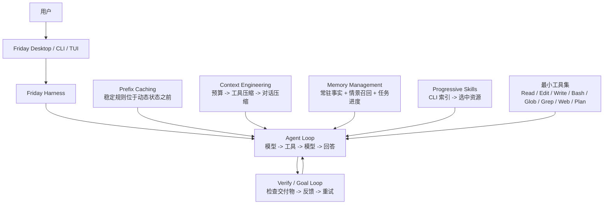

# Friday

[English](README.md)

Friday 是一个本地通用 Agent，提供 Windows 桌面端、TUI 和 CLI。它可以处理文件和命令、联网检索、记住用户与项目上下文，并持续执行任务直到完成或明确受阻。

底层的 [agent-core-runtime](https://github.com/Lancetwang/agent-core-runtime) 负责通用 Agent 执行。Friday Harness 负责提示词、上下文压缩、记忆、Skill、权限、验证与 Goal Loop、会话、Trace，以及桌面端、CLI 和 TUI。两者之间的边界契约见[架构文档](docs/architecture.md)。

## 安装

### Windows 桌面端（推荐）

打开 [GitHub Releases](https://github.com/Lancetwang/friday/releases)，下载最新的 Windows x64 安装程序（当前为 `Friday_0.1.0_x64-setup.exe`）并运行。安装包已包含 Friday 和 Python Runtime，不要求用户额外安装 Git、Python、Node.js 或 Rust。

启动 Friday 后，在**设置 > 模型**中配置至少一个模型供应商的 API Key。联网搜索 Key 和用户偏好也可以在设置中完成。

### 从源码安装

```powershell
git clone https://github.com/Lancetwang/friday.git
cd friday
npm --prefix ui-tui ci
npm --prefix ui-tui run build
uv tool install -e . --force --reinstall
```

源码安装会提供全局 `friday` CLI 与 TUI。源码目录需要保留，所有 Python 依赖，包括 [`friday-agent-core`](https://pypi.org/project/friday-agent-core/)，都会自动从 PyPI 解析。

两种安装方式的环境要求、配置、升级与卸载步骤见[中文安装文档](docs/install.zh-CN.md)。

## 特性

- 通用任务执行：处理本地文件与命令、联网检索，并让普通任务持续推进到交付与验证。
- 两层 Loop：Agent Loop 负责模型与工具交互；独立的 Verify / Goal Loop 检查交付物并依据证据驱动修正。
- Prefix 友好的上下文：稳定 Runtime 规则位于前部，用户、项目、Skill 和召回记忆按需渐进披露。
- 多级上下文压缩：先探测无损工具结果简化，必要时再进行结构化对话压缩并保留最近十个完整 Turn。
- 分层记忆与进度：稳定用户事实、项目知识、情景召回和可恢复任务进度彼此独立。
- 渐进式 Skill：先返回元数据和路径，只读取被选中的 `SKILL.md` 及其引用资源。
- 长程任务控制：显式目标、计划、下一步、验证状态、语义停止条件和 Session 恢复共同防止任务迷失。
- Turn 级检查点：`/undo` 同时恢复最近一次 Friday 执行前的工作区文件、对话和任务进度，不改动项目自身的 Git 历史。
- 程序级权限：危险 Bash 命令在执行前停止并请求明确批准。
- 有预算的联网检索：只为缺失证据继续搜索，并区分检索事实与模型推断。
- 精确统计与 Trace：记录 Provider Usage、模型调用、工具过程、压缩、验证和结果，支持检查与分析。
- Runtime 兼容性：固定经过验证的 [`friday-agent-core`](https://pypi.org/project/friday-agent-core/) 版本，并在执行前检查安装环境。

## 架构


```mermaid
flowchart TD
    User["用户"] --> Surface["Friday Desktop / CLI / TUI"]
    Surface --> Harness["Friday Harness"]

    Harness --> AgentLoop["Agent Loop<br/>模型 -> 工具 -> 模型 -> 回答"]
    AgentLoop --> OuterLoop["Verify / Goal Loop<br/>检查交付物 -> 反馈 -> 重试"]
    OuterLoop --> AgentLoop

    Prefix["Prefix Caching<br/>稳定规则位于动态状态之前"] --> AgentLoop
    Context["Context Engineering<br/>预算 -> 工具压缩 -> 对话压缩"] --> AgentLoop
    Memory["Memory Management<br/>常驻事实 + 情景召回 + 任务进度"] --> AgentLoop
    Skills["Progressive Skills<br/>CLI 索引 -> 选中资源"] --> AgentLoop
    Tools["最小工具集<br/>Read / Edit / Write / Bash / Glob / Grep / Web / Plan"] --> AgentLoop
```

## 文档

- [安装](docs/install.zh-CN.md) ([English](docs/install.md))
- [快速开始](docs/quick-start.zh-CN.md) ([English](docs/quick-start.md))
- [架构](docs/architecture.md)
- [模型配置](docs/model-configuration.md)
- [CLI 命令](docs/cli.md)
- [工具](docs/tools.md)
- [记忆](docs/memory.md)
- [Skills](docs/skills.md)
- [可观测性](docs/observability.md)
- [检查点与撤回](docs/checkpoints.md)

## 验证

```powershell
uv run python -m unittest discover -s tests
uv run python -m compileall src tests
npm --prefix ui-tui run typecheck
```
