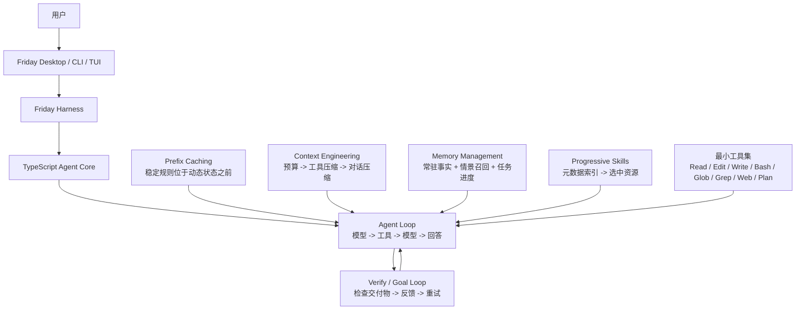

# Friday

<p align="center">
  
</p>

<p align="center">
  <a href="https://github.com/Lancetwang/friday/releases"></a>
  <a href="https://nodejs.org/"></a>
  <a href="https://www.npmjs.com/"></a>
  <a href="https://github.com/Lancetwang/friday/releases"></a>
  <a href="https://github.com/Lancetwang/friday/releases"></a>
  <a href="docs/install.zh-CN.md"></a>
  <a href="LICENSE"></a>
</p>

<p align="center"><a href="README.md">English</a></p>

Friday 是一个本地通用 Agent，提供 Windows、macOS 与 Linux 桌面端，以及跨平台 TUI。它可以处理文件和命令、联网检索、记住用户与项目上下文，并持续执行任务直到完成或明确受阻。

TypeScript Monorepo 同时包含可复用的轻量 Agent Core 与 Friday Harness。Harness 负责提示词、上下文压缩、记忆、Skill、权限、验证与 Goal Loop、会话、Trace 和 UI 行为。边界设计见 [TypeScript 迁移文档](docs/typescript-migration.md)。

## 安装

### 桌面端（推荐）

从 TypeScript 工作流产物下载 Windows x64 NSIS 安装程序、macOS Apple Silicon DMG 或 Linux x64 AppImage；迁移正式发布后会进入 [GitHub Releases](https://github.com/Lancetwang/friday/releases)。安装包内置独立的 TypeScript Sidecar，不要求用户安装 Git、Python、Node.js、Bun 或 Rust。

启动 Friday 后，在**设置 > 模型**中配置至少一个模型供应商的 API Key。联网搜索 Key 和用户偏好也可以在设置中完成。

### npm 安装

安装完整的 Core + Harness + TUI：

```bash
npm install --global friday-agent
friday
```

只在另一个 TypeScript 项目中安装可复用 Core：

```bash
npm install friday-agent-core
```

迁移分支评审期间 npm 包名尚未发布。请从
[TypeScript 工作流](https://github.com/Lancetwang/friday/actions/workflows/typescript.yml)
下载并解压 `Friday-npm-packages` 构建产物，再安装其中已经打好的完整包：

```bash
npm install --global ./friday-agent-0.2.0-alpha.0.tgz
friday
```

### 从源码安装

```powershell
git clone https://github.com/Lancetwang/friday.git
cd friday
git switch codex/typescript-rewrite
npm ci
npm link
friday
```

npm 与源码安装要求 Node.js 22 或更高版本。npm 会按平台生成 Shim，因此 PowerShell、cmd、bash 与 zsh 中都统一使用 `friday`。

两种安装方式的环境要求、配置、升级与卸载步骤见[中文安装文档](docs/install.zh-CN.md)。

## 特性

- 通用任务执行：处理本地文件与命令、联网检索，并让普通任务持续推进到交付与验证。
- 两层 Loop：Agent Loop 负责模型与工具交互；独立的 Verify / Goal Loop 检查交付物并依据证据驱动修正。
- Prefix 友好的上下文：稳定 Runtime 规则位于前部，用户、项目、Skill 和召回记忆按需渐进披露。
- 多级上下文压缩：先探测无损工具结果简化，必要时再进行结构化对话压缩，并在预算内最多保留最近十个完整用户 Turn。
- 分层记忆与进度：稳定用户事实、项目知识、情景召回和可恢复任务进度彼此独立。
- 渐进式 Skill：先用精简元数据路由，只读取被选中的 `SKILL.md` 及其引用资源。
- 长程任务控制：显式目标、计划、下一步、验证状态、语义停止条件和 Session 恢复共同防止任务迷失。
- Turn 级检查点：桌面端消息回退可同时恢复工作区文件、对话和任务进度，不改动项目自身的 Git 历史。
- 工具生命周期 Hook：执行前由代码完成权限预检，执行后用三轮滑动窗口识别工具名与参数完全相同的无进展循环；参数变化的正常重试不会被误拦截。
- 程序级权限：硬拒绝命令与显式 deny 规则在执行前停止；灰区命令可交给用户或独立意图审查器判断。
- 基于 Checkpoint 的交付物：真实被当前 Turn 修改的文件会附在回复中，安全的文档和图片格式可直接预览。
- Prompt Injection 边界：主 Agent 与辅助模型调用都保护私有控制上下文，并把检索内容视作不可信数据。
- 有预算的联网检索：只为缺失证据继续搜索，并区分检索事实与模型推断。
- 精确统计与 Trace：记录 Provider Usage、模型调用、工具过程、压缩、验证和结果，支持检查与分析。
- 评测契约：`friday run` 提供无交互沙箱执行，并输出 ATIF-v1.7 轨迹，可接入 Harbor、Terminal-Bench 和其他 Harness。

## 架构


```mermaid
flowchart TD
    User["用户"] --> Surface["Friday Desktop / CLI / TUI"]
    Surface --> Harness["Friday Harness"]
    Harness --> Core["TypeScript Agent Core"]

    Core --> AgentLoop["Agent Loop<br/>模型 -> 工具 -> 模型 -> 回答"]
    AgentLoop --> OuterLoop["Verify / Goal Loop<br/>检查交付物 -> 反馈 -> 重试"]
    OuterLoop --> AgentLoop

    Prefix["Prefix Caching<br/>稳定规则位于动态状态之前"] --> AgentLoop
    Context["Context Engineering<br/>预算 -> 工具压缩 -> 对话压缩"] --> AgentLoop
    Memory["Memory Management<br/>常驻事实 + 情景召回 + 任务进度"] --> AgentLoop
    Skills["Progressive Skills<br/>元数据索引 -> 选中资源"] --> AgentLoop
    Tools["最小工具集<br/>Read / Edit / Write / Bash / Glob / Grep / Web / Plan"] --> AgentLoop
```

## 文档

- [文档索引](docs/index.md) — 全部指南
- [安装](docs/install.zh-CN.md) ([English](docs/install.md))
- [更新日志](CHANGELOG.md)
- [快速开始](docs/quick-start.zh-CN.md) ([English](docs/quick-start.md))
- [架构](docs/architecture.md)
- [模型配置](docs/model-configuration.md)
- [CLI 命令](docs/cli.md)
- [工具](docs/tools.md)
- [记忆](docs/memory.md)
- [Skills](docs/skills.md)
- [验证](docs/verification.md)
- [评测](docs/evaluation.md)
- [可观测性](docs/observability.md)
- [检查点与撤回](docs/checkpoints.md)

## 验证

```powershell
npm ci
npm run check
npm test
npm ci --prefix ui-desktop
npm run build --prefix ui-desktop
```

## 开源协议

Friday 使用 [MIT License](LICENSE) 发布。
