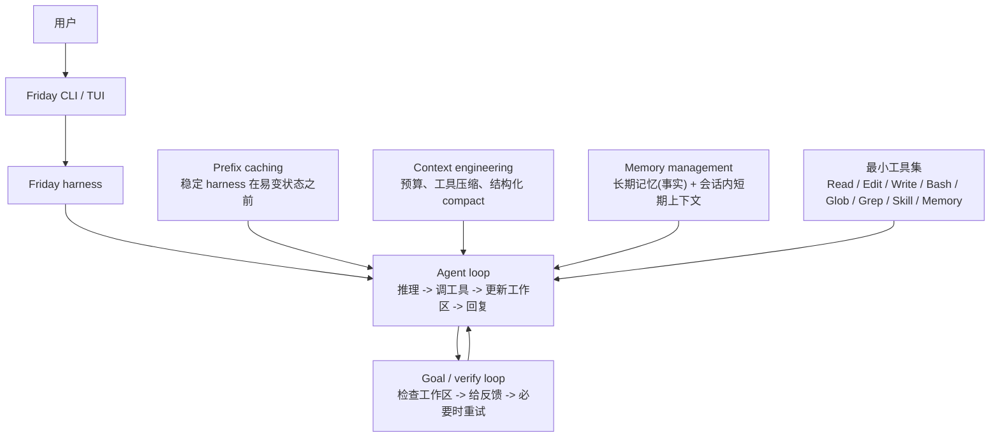

# Friday

[English README](README.md)

Friday 是一个本地命令行编码 agent。在工作区里运行 `friday`，就可以让它读文件、改代码、跑命令、记录项目事实，并验证改动结果。

底层用 `agent-core-runtime` 执行 agent，上层的 Friday harness 负责提示词、记忆文件、权限、上下文压缩、验证循环、skills 和终端 UI。项目状态放在 `.friday/`，用户状态放在 `~/.friday/`。

## 特性

- 默认感知工作区：在任意目录运行 `friday`，该目录就是 agent 的工作目录。
- Harness 优先的上下文设计：runtime 规则、skill 目录、用户画像、长期记忆、项目规则和环境信息按稳定顺序组装，方便 prefix caching。
- Agent 只做路由：启动 prompt 保持克制，项目文件、嵌套指令、记忆和工具按需进入上下文。
- 规则分层：`~/.friday/AGENTS.md` 是你在所有项目通用的全局规则；项目里的 `AGENTS.md`（根目录或嵌套）是项目规则，并覆盖全局规则。
- 即插即用 skills：从项目和 home 目录发现可复用的 `SKILL.md` 工作流，按需加载。
- 分层记忆：用户、全局、项目记忆保存耐久的声明式事实；短期任务上下文活在会话里，不落成持久文件。
- 多阶段上下文压缩：大体积工具结果只有在 cheap probe 判断收益足够时才压缩；否则直接进入会话 compact。
- 自动 verification loop：修改交付物的 turn 会由独立 verifier agent 检查，失败时给 main agent 一次修复机会。
- Goal mode：`/goal <task>` 会结合 verifier 反馈持续尝试，直到通过、被证明阻塞，或达到尝试上限。
- 上下文预算报告：`/context` 展示 system prompt、skill catalog、tool schema、messages、tool results 的本地估算占用；如果最近一次 API 返回了 usage，也会展示精确输入/输出 token。
- 本地 traces：每个 turn 都会写一行 JSONL，记录 prompt 摘要、runtime timeline、工具调用、验证结果、metrics 和最终回答。
- 程序执行的 Bash 权限：`.friday/permissions.json` 提供持久 allow、deny、approval 规则；`/approve` 会执行待审批命令，并把结果带回同一个会话。
- 会话恢复：每个会话在 `.friday/sessions/<id>.json` 保存一份快照、就地覆盖；恢复时在重建的最新前缀下还原它。
- 小工具集：读写编辑文件、shell、glob、grep、memory 覆盖核心编码循环，不依赖庞大框架。
- 本地状态：项目状态在 `<workspace>/.friday`，用户状态在 `~/.friday`。

## 架构


```mermaid
flowchart TD
    User["用户"] --> Friday["Friday CLI / TUI"]
    Friday --> Harness["Friday harness"]

    Harness --> AgentLoop["Agent loop<br/>推理 -> 调工具 -> 更新工作区 -> 回复"]
    AgentLoop --> VerifyLoop["Goal / verify loop<br/>检查工作区 -> 给反馈 -> 必要时重试"]
    VerifyLoop --> AgentLoop

    Prefix["Prefix caching<br/>稳定 harness 在易变状态之前"] --> AgentLoop
    Context["Context engineering<br/>预算、工具压缩、结构化 compact"] --> AgentLoop
    Memory["Memory management<br/>长期记忆(事实) + 会话内短期上下文"] --> AgentLoop
    Tools["最小工具集<br/>Read / Edit / Write / Bash / Glob / Grep / Skill / Memory"] --> AgentLoop
```

## Harness

Friday 会按稳定顺序组装模型上下文，方便 prefix caching：

1. `SOUL.md`：Friday 是谁。
2. Runtime instructions：工具、memory policy、项目规则发现、skills、permissions 和上下文压缩机制。
3. Tool Guidance：工具使用偏好。
4. 全局规则：`~/.friday/AGENTS.md`，你在所有项目通用的 Friday 操作规则。
5. `USER.md`：用户是谁，以及用户偏好如何工作。
6. 全局 `MEMORY.md`：跨项目事实和长期经验。
7. Skill Catalog：只放 skill 名称和描述。
8. 项目指令：`AGENTS.md` 和 `.friday/AGENTS.md`，从文件系统根向工作区逐级发现。
9. 环境信息：工作区、OS、shell、Friday home、安装路径、权限模式。
10. 项目 `.friday/MEMORY.md`：项目决策和本地上下文。

全局且由代码维护的前缀（第 1-3 项）在每个工作区都相同、只在升级时变化，因此排在最前面以利于 provider prefix caching；随后是全局用户层（4-6），最后是随项目变化的尾部（7-10）。环境信息为动态注入，因此实时 OS 和路径不会过期。

提示词文本集中在 `src/friday/prompts.py`，harness 各模块引用它而不是内嵌大字符串。内置默认文档模板放在 `src/friday/prompt_templates/`。

Friday 在首次运行时自动就位全局目录：任意 `friday` 命令都会确保 `~/.friday/` 里有 `SOUL.md`、`AGENTS.md`、`USER.md`、`MEMORY.md` 和 `FridaySkills/`（只补缺失的文件，运行时使用这些可编辑的 home 文件）。`friday init` 则是**项目级**，且**只生成项目的 `AGENTS.md`**；项目用到的记忆、权限、skills、会话都和项目规则无关，由运行时在需要时惰性创建。

过大的项目指令文件会在启动 prompt 中截断。嵌套目录里的 `AGENTS.md` 会在 Friday 触达该目录文件时按需加载，并且每个嵌套文件每个 session 只注入一次。

短期任务状态不落盘：它活在实时对话里，由 `friday resume` 恢复，上下文过长时压缩成会话内摘要消息。

## 记忆

Friday 按用途区分记忆：

- `SOUL.md`：Friday 的身份和工作风格。
- `USER.md`：稳定的用户画像和偏好。
- `~/.friday/MEMORY.md`：跨项目的全局记忆。
- `<workspace>/.friday/MEMORY.md`：只属于当前项目的记忆。
- `~/.friday/AGENTS.md`：Friday 在所有工作区遵循的全局规则，不是记忆。
- 项目 `AGENTS.md`：项目规则，不是记忆。

`Memory` 工具可以 `read`、`add`、`replace` 或 `remove` 条目。写入会立刻落盘，但启动 prompt 是冻结快照；新的长期记忆会在下一次会话自然生效。

`/compact` 会先让 Friday 用 `Memory` 工具保存真正值得长期保留的事实，然后把当前对话压缩成结构化摘要。摘要作为会话内消息注入（由下一次快照保存、由 resume 恢复），它不是长期记忆。

## 上下文管理

Friday 把上下文拆成几层，而不是把所有东西塞进一个不断增长的 prompt：

- 稳定前缀：身份、runtime 规则、用户画像、全局记忆、项目规则、环境信息、项目记忆按固定顺序组装，方便 prefix caching。
- 路由上下文：文件、嵌套 `AGENTS.md`、完整 skill 内容和 memory 读取结果，只有在 agent 需要时才进入对话。
- 工具压缩：当上下文占用达到窗口的 85% 时，Friday 会先 probe 大体积结构化工具结果；如果压缩它们预计能释放当前上下文至少 25% 的空间，就替换成短摘要。
- 会话压缩：如果工具 probe 不值得做，Friday 保留原有 compact 流程，并在压缩前先给 agent 一次机会把长期事实写入 memory。
- 短期上下文：conversation compact 会按固定结构（当前目标、已完成、未完成、尝试过的方法、决策、工作文件、命令结果、验证状态、下一步、最近对话）压缩，结果留在会话里而不是文件。
- 验证循环：当某一轮修改了交付物，Friday 会用独立 verifier 检查工作区状态，并在失败时把反馈交给 main agent 修复一次。
- Goal loop：`/goal <task>` 每轮都会强制验证，并持续到 verifier 通过、给出阻塞证据，或达到尝试上限。
- 预算可见：`/context` 会拆分展示 system prompt、skill catalog、tool schemas、messages、tool results 的当前占用。Friday 会对本地拼出的部分做估算，并在 provider 返回 usage 时记录最近一次精确输入/输出 token。

默认上下文窗口按 128K tokens 计算，可以用 `FRIDAY_CONTEXT_WINDOW` 覆盖。

## 会话

Friday 把每个会话写成 `<workspace>/.friday/sessions/<session_id>.json` 的**单份快照，每轮就地原子覆盖**（不再按轮追加，磁盘占用随当前上下文线性增长，而非平方级）。文件含 session id、时间、轮数、首条用户/末条回复的预览，以及当前完整消息列表。恢复时直接读这份快照、在重建的最新 system 前缀下原样还原对话体；列表与读取都不写盘。

CLI 和 TUI 使用同一套保存/恢复路径。TUI 会给最近会话的交互式选择；CLI 的 `friday resume` 默认恢复最近会话。

## Traces

Friday 会把 turn trace 写到 `<workspace>/.friday/traces/YYYYMMDD.jsonl`。每条 trace 记录用户输入、调用前模型可见 prompt 摘要、紧凑 runtime timeline、工具调用/结果摘要、验证结果、metrics 和最终回答。这里记录的是可观察行为；模型私有思考不会从 runtime 暴露。

## 权限

Friday 把持久权限和 prompt 规则分开：

- `.friday/permissions.json`：机器可读的 Bash 策略，包含 `allow`、`deny` 和 `require_approval` 列表。
- `.friday/pending_approval.json`：命令需要用户确认时写入的一次性 pending approval。
- `AGENTS.md`：人类可读的项目规则，可以说明权限策略，但不负责执行。

Bash 运行前会先检查 `permissions.json`。deny 规则会阻止命令，allow 规则会直接运行，approval 规则会创建待审批项，内置危险命令启发式作为兜底。审批通过后，Friday 会把命令执行结果写回上下文，再由 agent 生成面向用户的最终回复。

## Skills

Friday 会从 `.friday/FridaySkills/<skill>/SKILL.md` 和 `~/.friday/FridaySkills/<skill>/SKILL.md` 发现可复用 `SKILL.md` 工作流。

启动 prompt 只包含 skill 名称和描述。完整 `SKILL.md` 只有在相关时才通过 `Skill` 工具加载。

## 工具

Friday 默认提供一组小工具：

- `Read`：按行窗口读取文件。
- `Write`：覆盖写入文件。
- `Edit`：按行范围或精确文本匹配编辑文件。
- `Bash`：运行 shell 命令。Windows 下使用 PowerShell。破坏性命令需要审批。
- `Glob`：按路径模式查找文件。
- `Grep`：搜索文件内容。
- `Skill`：列出或读取可复用的 `SKILL.md` 工作流。
- `Memory`：读取或更新用户、全局、项目记忆。

## 安装

```powershell
uv sync
Copy-Item .env.example .env
cd ui-tui
npm install
cd ..
```

填写 `.env`：

```text
LLM_API_KEY=...
LLM_BASE_URL=https://api.deepseek.com
LLM_MODEL=deepseek-v4-flash
```

准备好后可以全局安装命令：

```powershell
uv tool install -e .
```

本地开发时，仓库里也提供了 `friday.cmd`。把仓库目录加入 `PATH`，或用完整路径调用它，它会以你当前所在目录作为 Friday 工作区。

## 使用

```powershell
friday
friday init
friday ask "summarize this project"
friday resume
friday approve
friday reject
friday chat   # 然后输入 /goal 描述任务
friday memory
friday reset
```

裸 `friday` 会在当前目录启动终端 agent。`friday reset` 会在确认后清空项目状态和全局 Friday 状态。

## 验证

```powershell
uv run python -m unittest discover -s tests
uv run python -m compileall src tests
```
