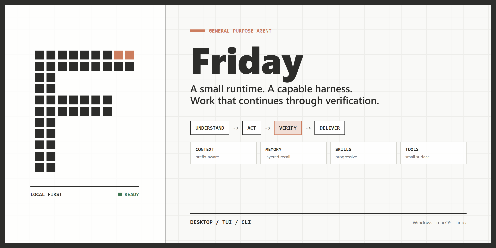
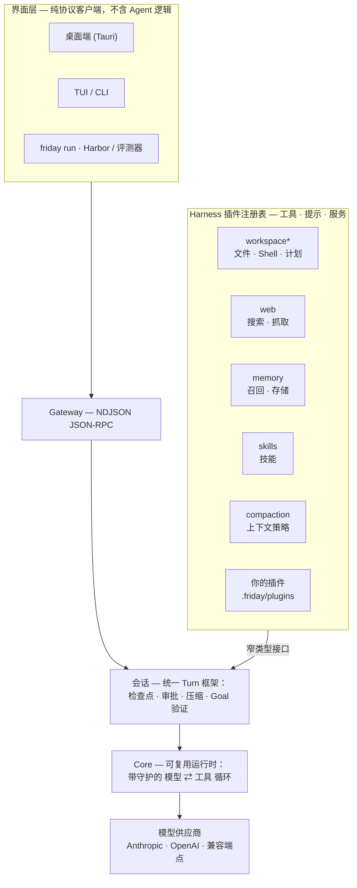

# Friday

<p align="center">
  
</p>

<p align="center">
  面向真实工作的本地优先 Agent，提供桌面应用、终端界面和无头评测 Runtime。
</p>

<p align="center">
  <a href="https://github.com/Lancetwang/friday/actions/workflows/typescript.yml"></a>
  <a href="https://www.npmjs.com/package/friday-agent"></a>
  <a href="https://github.com/Lancetwang/friday/releases"></a>
  <a href="LICENSE"></a>
</p>

<p align="center">
  <a href="README.md">English</a> ·
  <a href="docs/quick-start.zh-CN.md">快速开始</a> ·
  <a href="docs/index.md">文档</a> ·
  <a href="https://github.com/Lancetwang/friday/releases">下载</a>
</p>

Friday 在本地工作区内读取和编辑文件、执行命令、联网检索，并持续推进任务直到完成验证。会话、项目状态、凭据、记忆、检查点和 Trace 都保存在本机的 `~/.friday/` 下。

项目采用 TypeScript Monorepo，所有入口共用同一套 Runtime。桌面端和 TUI 都只是 Friday Harness 的客户端；无头评测也走同一条执行路径，而不是另写一个为 Benchmark 特化的简化 Agent。

“本地优先”不等于“完全离线”：模型请求和启用的联网工具会把任务所需内容发送给你配置的供应商。Friday 本身不运营托管账号或云同步后端。

## 为什么选择 Friday

- **桌面端与终端共用一个 Agent。** 日常工作使用原生桌面应用，在任意 Shell 中使用键盘优先的 TUI，或在隔离评测环境中运行 `friday run`。
- **长任务有明确结构。** 持久会话、显式计划、可恢复进度、上下文压缩和 Goal Mode 的独立验证 Loop 共同维持任务方向，同时保留可检查的状态变化。
- **本地状态可检查。** 项目状态存放在项目目录之外；凭据与会话、Trace 分离；UI 可以查看工具活动、用量、上下文压缩和验证证据。
- **执行边界由程序保证。** 工作区文件边界、危险命令硬拒绝、可配置审批、Secret 脱敏和验证器命令过滤由代码实施，而不只依赖提示词。
- **Core 可以独立复用。** [`friday-agent-core`](https://www.npmjs.com/package/friday-agent-core) 是一个公开的小型模型/工具 Loop，不依赖 Friday 的 UI、持久化、记忆或产品逻辑。

## 安装

根据工作方式选择入口：

| 入口 | 安装 | 启动 | 环境要求 |
| --- | --- | --- | --- |
| 桌面端 | 从 [GitHub Releases](https://github.com/Lancetwang/friday/releases) 下载 | 启动 Friday | Windows x64、macOS Apple Silicon 或 Debian/Ubuntu x64 |
| TUI + CLI | `npm install --global friday-agent` | `friday` | Node.js 22 或更高版本 |
| Agent Core | `npm install friday-agent-core` | 在 TypeScript/JavaScript 中导入 | Node.js 22 或更高版本 |

桌面安装包已经包含完整 Runtime，最终用户不需要安装 Git、Python、Node.js、Bun 或 Rust。

首次启动后，在桌面端的**设置 → 模型**或 TUI 的 `/login` 中配置供应商。Friday 内置支持 OpenAI、Anthropic、DeepSeek、小米 MiMo、OpenCode Go，也支持自定义 OpenAI-compatible Endpoint。

平台说明、升级、源码安装和卸载方式见[安装文档](docs/install.zh-CN.md)。

## 快速开始

在桌面端打开项目目录，或从项目目录启动 Friday：

```bash
cd path/to/your-project
friday
```

然后直接描述期望结果，例如：

```text
找出测试失败的原因，修复它，并验证结果。
```

不进入 TUI，执行一次无交互请求：

```bash
friday ask "总结这个仓库，并说明如何运行测试。"
```

使用独立 Goal 验证执行任务：

```bash
friday goal "修复失败的测试并验证结果。"
```

无头评测命令只应在隔离环境中运行：

```bash
friday run --cwd /workspace --json --trajectory /logs/trajectory.json -- "完成任务"
```

`friday run` 默认跳过交互审批，但仍保留危险命令硬拒绝。完整契约见 [CLI 命令](docs/cli.md)和[评测文档](docs/evaluation.md)。

## 核心能力

### 任务执行

Friday 将受保护的模型/工具 Loop 与文件读取、搜索、编辑、Shell、联网检索、记忆、Skill 和计划工具组合在一起。明确标记为可并发的工具可以并行执行；内置修改操作保持有序且可审计。

### 上下文、记忆与 Skill

稳定指令位于动态状态之前，以利用供应商的 Prefix Cache。上下文压缩是 Harness 插件，可配置触发阈值及自动或手动策略。兼容默认值是在 85% 时自动执行 insert-and-compact：用结构化摘要替换较早对话，并在目标预算内重放尽可能大的完整近期尾部；即使无法满足目标预算，也会保留最小近期尾部。可选的两阶段策略会先把足够旧的工具结果换成确定性收据，同时为 UI、Resume 和 Fork 保留精确原文；如果释放空间不足，会先完整回滚，再做语义压缩。长期事实、项目知识、情景记忆和当前任务进度彼此分离；Skill 先通过精简元数据发现，只在选中后加载正文与引用资源。

### 验证与恢复

Goal Mode 使用独立验证器检查交付物，并能把具体失败反馈给下一次尝试。修改型 Turn 在执行前物化的检查点可以同时恢复被修改的文件、对话边界和任务进度，不改动项目自身的 Git 历史或 Index。

### 可观测性

Trace Workbench 记录模型请求、工具调用与结果、耗时、供应商 Token 用量、上下文占用、压缩、审批和验证过程。联网证据与使用它的 Turn 关联，检索内容不会进入私有控制前缀。

## 架构


```mermaid
flowchart TB
    subgraph Surfaces["界面层 — 纯协议客户端，不含 Agent 逻辑"]
        direction LR
        Desktop["桌面端 (Tauri)"]
        TUI["TUI / CLI"]
        Headless["friday run · Harbor / 评测器"]
    end
    Surfaces --> Gateway["Gateway — NDJSON JSON-RPC"]
    Gateway --> Session["会话 — 统一 Turn 框架：<br/>检查点 · 审批 · 压缩 · Goal 验证"]
    subgraph Registry["Harness 插件注册表 — 工具 · 提示 · 服务"]
        direction LR
        Workspace["workspace*<br/>文件 · Shell · 计划"]
        Web["web<br/>搜索 · 抓取"]
        Memory["memory<br/>召回 · 存储"]
        Skills["skills<br/>技能"]
        Compaction["compaction<br/>上下文策略"]
        External["你的插件<br/>.friday/plugins"]
    end
    Registry -- "窄类型接口" --> Session
    Session --> Core["Core — 可复用运行时：<br/>带守护的 模型 ⇄ 工具 循环"]
    Core --> Providers["模型供应商<br/>Anthropic · OpenAI · 兼容端点"]
```

`*` 为必需插件；其余每一个——内置或自建——都可在 TUI（`/plugins`）、桌面设置或 `disabled_plugins` 中关闭。

- `packages/core` 包含公开的 `Agent`、`RunContext`、供应商适配器、工具执行、事件、用量、取消与预检契约。
- `packages/harness` 构成 Friday 产品层，负责插件、提示词、工具、模型配置、会话、权限、压缩、记忆、Skill、检查点、Trace 和验证。
- `packages/protocol` 是 Harness 与两个 UI 共用的纯类型通信契约；它没有运行时代码，也不导入 Core 或 Harness。
- `ui-tui` 与 `ui-desktop` 是协议客户端，不包含第二套 Agent Loop。
- `integrations/harbor` 是 Harbor Python 自定义 Agent 协议的薄适配器，实际安装并调用 TypeScript 包。

架构刻意使用普通的异步控制流，而不是引入通用 Graph 抽象。Runtime 边界和安全约束见[架构文档](docs/architecture.md)。

## 评测

Friday 提供进程级评测契约，不将 Core 绑定到某个 Benchmark。`friday run` 可以输出 ATIF v1.7 轨迹，包含模型标识、工具调用、Observation、最终回答和可用的用量数据。

仓库内置的 Harbor Adapter 可以在 Terminal-Bench 2.1 中运行 npm 分发的 Friday Runtime。调用方式与可复现建议见[评测文档](docs/evaluation.md)。

## 仓库结构

```text
packages/core/          可复用的 Agent Loop 与供应商适配器
packages/harness/       Friday Runtime、状态、工具与 Gateway
packages/protocol/      Harness/UI 共用的纯类型通信契约
ui-tui/                 终端 UI 与跨平台 CLI
ui-desktop/             React + Tauri 桌面应用
integrations/harbor/    Terminal-Bench / Harbor 适配器
docs/                   用户与架构文档
```

## 开发

```bash
git clone https://github.com/Lancetwang/friday.git
cd friday
npm ci
npm test
npm run check
```

桌面端开发还需要稳定版 Rust Toolchain 和当前平台的 Tauri 依赖：

```bash
npm ci --prefix ui-desktop
npm run desktop
```

CI 会在 Windows、macOS 和 Linux 上验证 Core、Harness、CLI、桌面前端、独立 sidecar 与 Tauri Bridge。Tag 构建还会生成三个桌面安装包、校验和与经过测试的 npm tarball。

## 文档

- [快速开始](docs/quick-start.zh-CN.md)
- [安装](docs/install.zh-CN.md)
- [模型配置](docs/model-configuration.md)
- [CLI 参考](docs/cli.md)
- [架构](docs/architecture.md)
- [工具与权限](docs/tools.md)
- [记忆](docs/memory.md)与 [Skill](docs/skills.md)
- [验证](docs/verification.md)与[检查点](docs/checkpoints.md)
- [可观测性](docs/observability.md)与[评测](docs/evaluation.md)
- [更新日志](CHANGELOG.md)

## 参与贡献

欢迎提交 Issue 和 Pull Request。请保持改动聚焦，维护 Core/Harness 边界，并补充能够证明行为的最小测试。提交前运行 `npm test` 和 `npm run check`；桌面端改动还应通过 `npm run build --prefix ui-desktop`。

如需报告安全问题，请勿在公开 Issue 中粘贴凭据、Trace 或私有工作区内容。

## 开源协议

Friday 使用 [MIT License](LICENSE) 发布。
