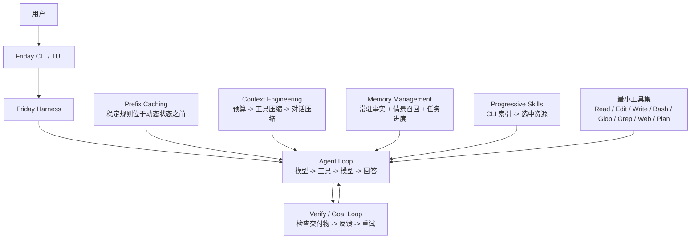

# Friday

[English](README.md)

Friday 是一个本地 CLI 编程 Agent。在任意项目目录运行 `friday`，即可让它读取和修改文件、执行命令、联网检索、维护项目知识，并验证最终交付结果。

底层的 [agent-core-runtime](https://github.com/Lancetwang/agent-core-runtime) 负责通用 Agent 执行。Friday Harness 负责提示词、上下文压缩、记忆、Skill、权限、验证与 Goal Loop、会话、Trace、CLI 和 TUI。

## 安装

```powershell
git clone https://github.com/Lancetwang/friday.git
cd friday
npm --prefix ui-tui ci
npm --prefix ui-tui run build
uv tool install -e . --force --reinstall
```

将 API Key 写入 `~/.friday/.env`，将模型配置写入 `~/.friday/config.json`，之后即可在任意项目目录运行 `friday`。完整的环境要求、配置、验证、升级与卸载步骤见 [安装文档](docs/install.md)。

## 特性

- 工作区感知：从哪个目录启动 `friday`，哪个目录就是当前工作区。
- 分层模型配置：供应商、模型和 Token 预算写入全局 JSON，并可由项目覆盖；密钥继续留在 `.env`。
- Harness 优先的上下文设计：稳定规则放在前面，用户与项目状态放在后面，适配 Prefix Caching。
- Agent 只负责路由：文件、嵌套规则、Skill 正文和情景记忆都按需进入上下文。
- 分层规则：全局 `~/.friday/AGENTS.md`，以及项目根目录和嵌套目录中的 `AGENTS.md`。
- 渐进式 Skill：启动提示词只保留一条 CLI 路由；`friday skill list --json` 动态返回结构化元数据和路径，Bash 只读取被选中的 `SKILL.md` 和引用资源。
- 分层记忆：用户画像和长期事实常驻 Prefix，按日期保存的 Markdown 情景记忆按需召回，当前进度作为独立 Session 快照恢复。
- 可见进度：复杂任务维护一个目标、结构化计划、状态、下一步和验证结果，但不会为不同任务切换对话上下文。
- 多级上下文压缩：先探测无损工具结果简化的收益，收益不足时再生成结构化摘要并原样保留最近十个完整 Turn。
- 完成优先：普通执行请求也会继续完成实现与验证，不停在计划、进度或部分结果。
- 有预算的联网检索：只有缺少必要证据时才继续搜索；有事实依据的回答只引用已检索来源，并区分事实与推断。
- 独立验证：Verifier 不相信主 Agent 的描述，而是自己检查工作区交付物。
- 自适应验证：简单交付物只做最小充分的独立检查；具体 Repair 不受固定次数限制，直到语义停止条件成立。
- Goal 模式：`/goal <任务>` 持续锚定原始目标并以 Verifier 通过为完成门槛，在阻塞、证据不足、重复无进展、等待审批或 Token Budget 耗尽时停止。
- 程序级权限：危险 Bash 命令在执行前被拦截，需要用户明确批准。
- 运行级 Token 统计：汇总主 Agent 和 Verifier 的模型调用；Provider 不返回 Usage 时才标记为估算。
- Trace Workbench：每个 Session 以只追加方式记录模型请求与响应、工具过程、压缩、验证、Usage 和结果；无损记录之上提供 `YOU / FRI / TOOL` 行为时间线和单次 DeepSeek 证据分析。
- Session 恢复：每个会话保存一个原子快照，在最新 Prefix 下同时恢复完整对话和当前进度。
- 兼容的 Runtime 升级：Friday 固定经过验证的 agent-core 源，并在每轮开始前检查隔离环境是否匹配。

## 架构


```mermaid
flowchart TD
    User["用户"] --> Surface["Friday CLI / TUI"]
    Surface --> Harness["Friday Harness"]

    Harness --> AgentLoop["Agent Loop<br/>模型 -> 工具 -> 模型 -> 回答"]
    AgentLoop --> OuterLoop["Verify / Goal Loop<br/>检查交付物 -> 反馈 -> 重试"]
    OuterLoop --> AgentLoop

    Prefix["Prefix Caching<br/>稳定规则位于动态状态之前"] --> AgentLoop
    Context["Context Engineering<br/>预算 -> 工具压缩 -> 对话压缩"] --> AgentLoop
    Memory["Memory Management<br/>常驻事实 + 情景召回 + 任务进度"] --> AgentLoop
    Skills["Progressive Skills<br/>CLI 索引 -> 选中资源"] --> AgentLoop
    Tools["最小工具集<br/>Read / Edit / Write / Bash / Glob / Grep / Web / Plan"] --> AgentLoop
```

## Harness

Friday 按以下顺序组装模型 Prefix：

1. `SOUL.md`：身份和工作风格。
2. 内置 `RUNTIME.md`：任务完成、联网检索、记忆、项目规则发现、权限、压缩和验证。
3. 内置 `TOOL_GUIDANCE.md`。
4. `~/.friday/AGENTS.md` 中的全局规则。
5. `~/.friday/USER.md` 用户画像。
6. 全局 `~/.friday/MEMORY.md`。
7. 一行 Skill 发现与按需路由规则。
8. 项目根目录与嵌套项目规则。
9. 实时环境信息。
10. 项目 `.friday/MEMORY.md`。

静态系统 Prompt 由内置 Markdown 文件提供，不再硬编码为 Python 长字符串。代码控制的稳定 Prefix 位于最前面，只在升级时变化；用户信息位于中间，工作区相关状态位于尾部。这样可以尽量复用 Provider Cache，同时保证路径和项目状态不会过期。

Friday 首次启动会补齐 `~/.friday/` 下缺少的默认文件和内置 `friday-cli` Skill。`friday init` 只负责创建项目 `AGENTS.md`，项目记忆、权限、Skill 和 Session 按需创建；原始 Trace 统一保存在 `~/.friday/observability/`。

## 记忆

Friday 将事实、规则与任务状态分开：

- `USER.md`：稳定的用户画像与偏好。
- `~/.friday/MEMORY.md`：跨项目长期事实。
- `<workspace>/.friday/MEMORY.md`：项目长期事实和决策。
- `~/.friday/memory/YYYY-MM-DD.md`：按日期保存的个人背景和明确偏好原话，仅在相关时召回。
- `AGENTS.md`：行为规则，不属于记忆。
- `friday.progress`：当前目标、计划、状态与下一步的唯一来源。
- Session 与 Trace：可恢复上下文和观测证据，不是另一套任务状态。

Harness 会按代码规则捕获明确偏好和纠正信号，只把高置信用户画像自动晋升到 `USER.md`，拒绝凭证类内容，并通过中英文词项匹配按需注入最多三条相关情景记忆。记忆管理通过 `friday memory ...` 和 Bash 渐进披露，不再占用一个模型工具；内置 `friday-cli` Skill 负责说明具体命令。在对话压缩前，Friday 仍会要求 Agent 只保存真正值得长期保留的事实，压缩摘要和临时任务进度不会污染长期记忆。

## 上下文管理

- 默认上下文窗口为 353K，单次输出预算默认为 64K；两者均可通过全局或项目配置覆盖。
- 上下文达到 85% 时，先探测超大工具结果的压缩收益。
- 只有无损改写能保留全部字段且预计释放至少 25% 上下文时，才简化工具结果。
- 否则执行一次带当前 Prefix 的结构化对话压缩。
- 重建后的上下文由新 Prefix、结构化摘要和压缩前最近十个完整用户 Turn 组成；其中配套的 Assistant Tool Call 与 Tool Result 也会原样保留。
- `/context` 分别显示 System Prompt、Skill 路由、工具 Schema、消息和工具结果，并展示最近一轮 Provider Usage。

## 升级

Friday 通过固定依赖，让 Agent 和 agent-core 一起升级：

```powershell
cd path\to\friday
git pull --ff-only
npm --prefix ui-tui ci
npm --prefix ui-tui run build
uv tool install -e . --force --reinstall
```

不要在 Friday 的隔离工具环境里单独升级 agent-core。如果新版 core 尚未被 Friday 固定，说明两者还没有完成兼容性验证。Friday 启动时会检查实际安装来源是否等于当前 Pin，并在执行任何一轮任务前给出重装命令。

## 文档

- [安装](docs/install.md)
- [快速开始](docs/quick-start.md)
- [模型配置](docs/model-configuration.md)
- [CLI 命令](docs/cli.md)
- [工具](docs/tools.md)
- [记忆](docs/memory.md)
- [Skills](docs/skills.md)

## 验证

```powershell
uv run python -m unittest discover -s tests
uv run python -m compileall src tests
npm --prefix ui-tui run typecheck
```
