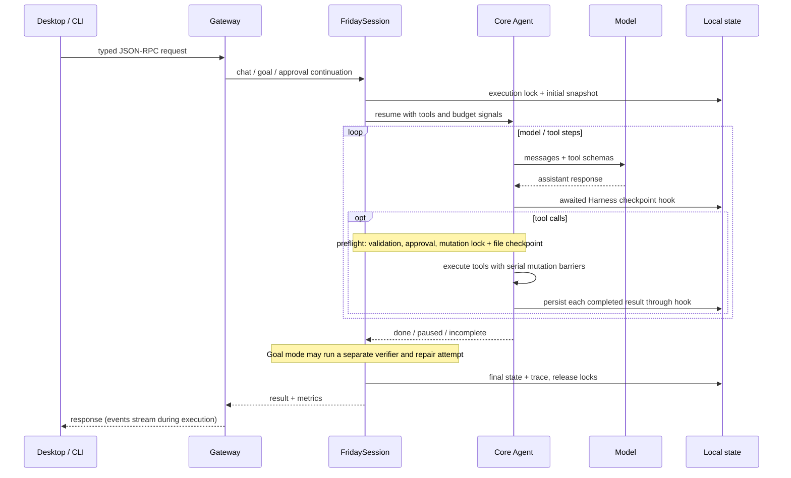

# Architecture

Friday is one TypeScript monorepo with a one-way dependency from the product
Harness to the reusable Agent Core.

## Core

`packages/core` is the reusable unit. `Agent` owns the bounded
model → tools → model loop and accepts an `AbortSignal`. `ToolExecutor` parses
calls, runs tool preflight, races execution against cancellation, preserves
serial barriers, and executes explicitly parallel tools in batches of at most
four. Provider adapters implement one `ChatModel` contract.

`RunContext` is deliberately generic. It owns messages, usage counters, ordered
events, and untyped `metadata` and `artifacts` bags. It does not own Friday
sessions, approvals, cancellation policy, or tool preflight. The Harness stores
product context such as progress and token anchors in those generic bags.

Core knows nothing about settings, persistence, memory, prompts, verification,
or any UI. There is no generic graph API: the current runtime has one execution
shape, and ordinary async control flow keeps it small and inspectable.

## Harness

`packages/harness` turns Core into the Friday product. It owns:

- prompt composition and pluggable context compaction policy;
- model profiles and provider selection;
- workspace, shell, web, memory, skill, and plan tools;
- permissions, approvals, and hard command denials;
- sessions, traces, checkpoints, undo, and recovery;
- independent Goal-mode verification;
- the NDJSON JSON-RPC gateway.

The dependency direction is strict: Core never imports Harness. The opposite
direction is a package boundary, not a single-file translation facade; Harness
modules import Core's public `Agent`, `RunContext`, message, event, model, and
tool contracts where they need them. The UIs do not duplicate the Agent Loop or
mutate a running `Agent` directly.

`packages/protocol` contains only the gateway's serializable TypeScript types.
Harness and both clients compile against that one wire contract, so a status or
event shape cannot drift independently in the TUI and desktop. Protocol imports
neither Core nor Harness and emits no JavaScript into the product bundles.

## Capability registry

Tools, capability-specific prompt sections, transparent tool wrappers, and the
singleton memory and context-compaction services are assembled through one
Harness plugin registry ([details](plugins.md)). Friday ships five built-in
packs: the required `workspace` pack plus optional `web`, `memory`, `skills`,
and `compaction` packs. Built-in packs may additionally declare which of their
tools the Goal verifier can receive; external plugins cannot extend the
verifier.

The registry is a capability boundary with per-session activation and cleanup.
Plugins can acquire resources in `activate()` and release them on reload or
close; reload is restricted to idle sessions. Sessions,
checkpoints, traces, approvals, and the verification loop remain ordinary
Harness code. The `memory` pack gates the Harness's per-turn capture and recall
hooks through a selected memory provider; the `compaction` pack owns automatic
and manual model-context rewriting through a selected compactor. The Harness
retains timing, message placement, session persistence, and safety guards. This
keeps product policy replaceable without adding memory, persistence, or Friday
settings to Core.

## Surfaces

TUI and desktop are protocol clients of the same gateway. Desktop releases
compile the gateway into a standalone Bun sidecar; npm installs bundle the
Harness next to the `friday` entry point and declare `friday-agent-core` as an
ordinary package dependency. The desktop sidecar bundles that same Core package
only so installers remain self-contained. Neither client contains another Agent
Loop. Embedded hosts can bypass the gateway and call `FridaySession` through
the workspace-only Harness SDK; the SDK is not separately published to npm.
See [SDK composition and migration](runtime-sdk.md).

## State and concurrency

A live session owns its Agent, RunContext, approval state, progress artifact,
cancel/budget controllers, and managed background process registry. Switching
the UI to another conversation does not stop it. Deleting or evicting the
session does stop its managed services. The gateway serializes navigation and shared settings mutations, while
each session rejects a second concurrent turn of its own. A cross-process
execution lock also protects a persisted session, and revision checks reject
stale saves. A workspace mutation lock coordinates built-in mutating turns
across cooperating Friday processes; it does not lock out editors or
already-running background services. Tools explicitly
marked parallel-safe use promise concurrency. Every other tool - including
mutations, plan or memory operations, and Bash - is a serial barrier.

Core normalizes provider stop metadata to `stop`, `tool_calls`, `length`,
`content_filter`, `incomplete`, or `unknown`. A response with neither visible
text nor an executable tool call is never successful: Core asks the same model
to recover, then fails clearly after a bounded number of empty responses.
Harness applies a shared resource ledger to main and auxiliary model calls,
including retries and Goal verification. Default limits are 100 requests, 400
tool calls, 15 minutes, and the profile token budget (40 million by default).
Its tool signal ends work before the hard model signal, leaving a finishing
reserve. Provider-reported usage is preferred; missing usage is estimated.
See [budget details](runtime-sdk.md#budgets-and-model-limits).

The session loader still hydrates legacy `artifacts`, `metrics`, and
`activities` metadata arrays when they are present in an older snapshot.
Checkpoint file content lives in a private content-addressed store. Sessions,
forks, and checkpoints reference shared immutable pages of 32 messages under
`message-objects`; old inline arrays remain readable and migrate on save.
Checkpoints never use or alter the workspace's Git index, branch, stash, or
commits. See [Checkpoints](checkpoints.md) for scope and pruning.

Model responses are persisted before tool dispatch, and completed tool results
are persisted before the next model request. Recovery repairs unfinished tool
calls with an explicit uncertainty result, without replaying their effects.
This is recoverable execution, not an exactly-once side-effect guarantee.

## Security boundary

Files, web pages, tool output, memory, traces, and plugin code are untrusted
inputs. File tools confine ordinary reads and all writes to the workspace,
except for user-selected attachments and Friday-managed tool-spill paths.
`Bash` is not a sandbox: it runs with the launching user's privileges and can
address paths outside the workspace, after command preflight.

Code enforces path checks, secret redaction, hard-denied command patterns, and
the configured approval mode. The verifier receives a Bash tool with additional
common-mutation filtering, but this is command policy rather than an operating-
system read-only sandbox. Bypass mode skips interactive approval, never hard
denials, and is intended only for isolated evaluation containers. External
plugins are trusted local code running with Friday's own process privileges.

The optional Docker execution backend isolates Bash in an existing local image,
with networking disabled by default and read-only workspace mounts for verifier
commands. It does not isolate in-process plugins or the entire Harness. See
[execution backends](runtime-sdk.md) for requirements and limits.
