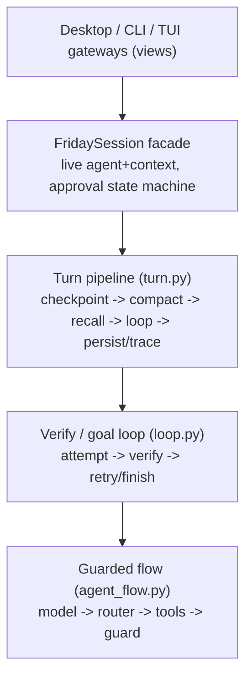

# Architecture

Friday is built on [agent-core-runtime](https://github.com/Lancetwang/agent-core-runtime), published on PyPI as [`friday-agent-core`](https://pypi.org/project/friday-agent-core/). The two codebases tell two deliberately different stories, and the value of the design is that neither story leaks into the other.

## Two stories

**agent-core-runtime** is the smallest unit that runs one agent, extensible into workflows and multi-agent systems. It owns *execution*: the Flow/Node graph, the model and tool nodes, and the per-run `RunContext` (messages, events, usage). It knows nothing about sessions, memory, permissions, or any product surface.

**Friday** is a personal agent harness. It owns the *session*: prompts and their layering, context budget and compaction, memory, skills, permissions and approvals, verification and goal loops, progress, turn checkpoints, traces, and the CLI/TUI surfaces. It treats the runtime as an engine it configures and drives, never as a data structure it reaches into.

## The boundary contract

Friday talks to the runtime only through its public API:

- Flows are composed from published nodes (`ModelNode`, `ToolRouterNode`, `ToolCallNode`, `CallableNode`) in [`agent_flow.py`](../src/friday/agent_flow.py).
- Agents are driven through `Agent(flow, instructions)` and `agent.chat(..., context=...)`.
- `RunContext` is used through `add_message`, `get_messages`, `metadata`, `artifacts`, `emit`, usage snapshots, and the `on_event` / `on_observation` subscriptions.

Friday never rewrites the runtime's internal message bookkeeping (scope tables, message lists). When conversation history must change — compaction, resume, undo — Friday rebuilds a fresh agent/context pair and replays its own state through the public API.

One deliberate exception: a rebuilt context aliases the previous `RunUsage` object (a public field) so run-level token budget accounting spans compaction. The call site documents it.

## Security boundary

Friday places a code-owned security contract before its runtime rules. It treats the first visible user message as the conversation boundary, keeps earlier control context private, and treats retrieved files, web content, tool output, traces, and memory as untrusted data. The same contract protects the main agent, verifier, trace analyst, and memory consolidation calls. Prompt-dump commands and gateway methods are intentionally unavailable; `/context` exposes usage totals, not instruction content.

## Session state kernel

[`state.py`](../src/friday/state.py) is the single source of truth for what a conversation *is*:

- `SessionState` — conversation body (no system prefix), progress, last usage, turn count.
- Session persistence — one JSON snapshot per session, overwritten atomically each turn.
- `hydrate(context, state)` — replays owned state into a freshly built context.

Every rebuild is the same two steps, regardless of why it happens:

```python
agent, context = build_friday(workspace)   # fresh prefix from disk
hydrate(context, state)                    # replay the owned session state
```

Compact, resume, and undo are just different ways to compute `state`:

- **compact** → state = structured summary + latest complete turns, same progress
- **resume** → state = saved session snapshot
- **undo** → state = checkpointed messages + checkpointed progress

Derived state is tagged, not sniffed: the trailing progress checkpoint message carries a `friday_progress` marker so it can be regenerated instead of persisted as conversation.

## Execution shape



- **Guarded flow** — the inner agent loop. Before execution, a permission hook rejects, reviews, or suspends risky calls. After every tool round, post-tool hooks handle pending approval, attach tool-produced images, and compare exact tool name/argument signatures across a three-round sliding window. The guard then handles context-window pressure. It probes lossless tool-result compaction first (full outputs stay on disk) and only forces a final answer when neither compaction pass can bring the prompt below the threshold.
- **Verify / goal loop** — runs attempts and independent verification. Between repair attempts it may compact the conversation, which rebuilds the agent/context pair; it therefore returns the final pair and callers continue with it.
- **Turn pipeline** — wraps one user turn with checkpointing, compaction checks, memory recall/capture, tracing, and persistence.
- **Session facade** — [`session.py`](../src/friday/session.py) is the single owner of the live agent/context and the approve / reject / continue-with-guidance state machine. The CLI and the TUI gateway are thin views: they render events and turn results and never mutate agent state themselves.

## State on disk

| Store | Path | Owner |
| --- | --- | --- |
| Project identity | `~/.friday/projects/<workspace-id>/project.json` | `storage.py` |
| Session snapshots | `~/.friday/projects/<workspace-id>/sessions/*.json` | `state.py` |
| Turn checkpoints | `~/.friday/projects/<workspace-id>/checkpoints/` | `checkpoint.py` |
| Large tool results | `~/.friday/projects/<workspace-id>/tool-results/<session-id>/` | `tools.py` |
| Pending approval | `~/.friday/projects/<workspace-id>/approvals/<session-id>.json` | `tools.py` |
| Traces | observability dir (see [Observability](observability.md)) | `trace.py` |
| Memory | `~/.friday/…` (see [Memory](memory.md)) | `memory.py` |

Deleting a conversation removes its session snapshot, trace, checkpoints, and
session-scoped large tool results together. Runtime events are persisted to the
trace and released from the live context after each turn.

One approval file per session keeps concurrent conversations from answering each
other's prompts, and claiming an approval renames the file so a duplicate
approval cannot run the command twice. Approval policy is likewise per session:
`FRIDAY_PERMISSION_MODE` supplies the starting default, and a mode chosen in the
desktop applies to the current conversation and ones started after it, never to a
conversation that already exists or is mid-run. Every write to shared state goes
through the atomic replace in `storage.py`, so a reader never sees a half-written
file.
