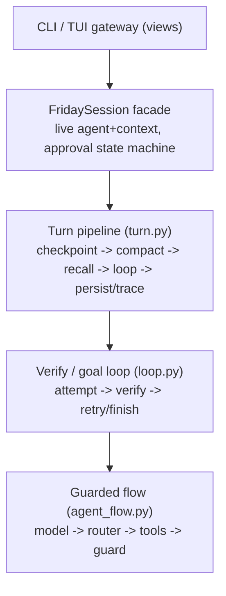

# Architecture

Friday is built on [agent-core-runtime](https://github.com/Lancetwang/agent-core-runtime), published on PyPI as [`friday-agent-core`](https://pypi.org/project/friday-agent-core/). The two codebases tell two deliberately different stories, and the value of the design is that neither story leaks into the other.

## Two stories

**agent-core-runtime** is the smallest unit that runs one agent, extensible into workflows and multi-agent systems. It owns *execution*: the Flow/Node graph, the model and tool nodes, and the per-run `RunContext` (messages, events, usage). It knows nothing about sessions, memory, permissions, or any product surface.

**Friday** is a personal agent harness. It owns the *session*: prompts and their layering, context budget and compaction, memory, skills, permissions and approvals, verification and goal loops, progress, turn checkpoints, traces, and the CLI/TUI surfaces. It treats the runtime as an engine it configures and drives, never as a data structure it reaches into.

## The boundary contract

Friday talks to the runtime only through its public API:

- Flows are composed from published nodes (`ModelNode`, `ToolRouterNode`, `ToolCallNode`, `CallableNode`) in [`agent_flow.py`](../src/friday/agent_flow.py).
- Agents are driven through `Agent(flow, instructions)` and `agent.chat(..., context=...)`.
- `RunContext` is used through `add_message`, `get_messages`, `metadata`, `artifacts`, `emit`, usage snapshots, and the `on_event` / `on_observation` subscriptions.

Friday never rewrites the runtime's internal message bookkeeping (scope tables, message lists). When conversation history must change — compaction, resume, undo — Friday rebuilds a fresh agent/context pair and replays its own state through the public API.

One deliberate exception: a rebuilt context aliases the previous `RunUsage` object (a public field) so run-level token budget accounting spans compaction. The call site documents it.

## Session state kernel

[`state.py`](../src/friday/state.py) is the single source of truth for what a conversation *is*:

- `SessionState` — conversation body (no system prefix), progress, last usage, turn count.
- Session persistence — one JSON snapshot per session, overwritten atomically each turn.
- `hydrate(context, state)` — replays owned state into a freshly built context.

Every rebuild is the same two steps, regardless of why it happens:

```python
agent, context = build_friday(workspace)   # fresh prefix from disk
hydrate(context, state)                    # replay the owned session state
```

Compact, resume, and undo are just different ways to compute `state`:

- **compact** → state = structured summary + latest complete turns, same progress
- **resume** → state = saved session snapshot
- **undo** → state = checkpointed messages + checkpointed progress

Derived state is tagged, not sniffed: the trailing progress checkpoint message carries a `friday_progress` marker so it can be regenerated instead of persisted as conversation.

## Execution shape



- **Guarded flow** — the inner agent loop. The guard node checks, after every tool round: pending approval (explicit suspend node ends the run), repeated no-progress cycles, the run token budget, and context-window pressure. Window pressure is relieved losslessly first (tool-result compaction; full outputs stay on disk) and only forces a final answer when the window is nearly full.
- **Verify / goal loop** — runs attempts and independent verification. Between repair attempts it may compact the conversation, which rebuilds the agent/context pair; it therefore returns the final pair and callers continue with it.
- **Turn pipeline** — wraps one user turn with checkpointing, compaction checks, memory recall/capture, tracing, and persistence.
- **Session facade** — [`session.py`](../src/friday/session.py) is the single owner of the live agent/context and the approve / reject / continue-with-guidance state machine. The CLI and the TUI gateway are thin views: they render events and turn results and never mutate agent state themselves.

## State on disk

| Store | Path | Owner |
| --- | --- | --- |
| Session snapshots | `.friday/sessions/*.json` | `state.py` |
| Turn checkpoints | checkpoint dir (see [Checkpoints](checkpoints.md)) | `checkpoint.py` |
| Pending approval | `.friday/pending_approval.json` | `tools.py` |
| Traces | observability dir (see [Observability](observability.md)) | `trace.py` |
| Memory | `~/.friday/…` and `.friday/MEMORY.md` (see [Memory](memory.md)) | `memory.py` |
