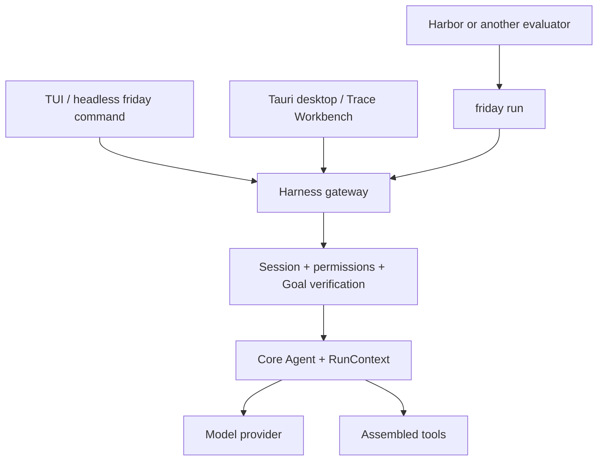

# Architecture

Friday is one TypeScript monorepo with a one-way dependency from the product
Harness to the reusable Agent Core.

## Core

`packages/core` is the reusable unit. `Agent` owns the bounded
model → tools → model loop and accepts an `AbortSignal`. `ToolExecutor` parses
calls, runs tool preflight, races execution against cancellation, preserves
serial barriers, and executes explicitly parallel tools in batches of at most
four. Provider adapters implement one `ChatModel` contract.

`RunContext` is deliberately generic. It owns messages, usage counters, ordered
events, and untyped `metadata` and `artifacts` bags. It does not own Friday
sessions, approvals, cancellation policy, or tool preflight. The Harness stores
product context such as progress and token anchors in those generic bags.

Core knows nothing about settings, persistence, memory, prompts, verification,
or any UI. There is no generic graph API: the current runtime has one execution
shape, and ordinary async control flow keeps it small and inspectable.

## Harness

`packages/harness` turns Core into the Friday product. It owns:

- prompt composition and context compaction;
- model profiles and provider selection;
- workspace, shell, web, memory, skill, and plan tools;
- permissions, approvals, and hard command denials;
- sessions, traces, checkpoints, undo, and recovery;
- independent Goal-mode verification;
- the NDJSON JSON-RPC gateway.

The dependency direction is strict: Core never imports Harness. The opposite
direction is a package boundary, not a single-file translation facade; Harness
modules import Core's public `Agent`, `RunContext`, message, event, model, and
tool contracts where they need them. The UIs do not duplicate the Agent Loop or
mutate a running `Agent` directly.

## Capability registry

Tools and capability-specific prompt sections are assembled through one plugin
registry ([details](plugins.md)). Friday ships four built-in packs: the required
`workspace` pack plus optional `web`, `memory`, and `skills` packs. External
plugins use the same tool, prompt-section, and transparent wrapper contracts.
Built-in packs may additionally declare which of their tools the Goal verifier
can receive; external plugins cannot extend the verifier.

The registry is a capability boundary, not the whole Harness. Session
lifecycle, compaction, checkpoints, traces, approvals, and the verification
loop remain ordinary Harness code. Disabling `memory` also disables the
Harness's per-turn capture and recall hook, while disabling `web` or `skills`
removes their tools and prompt sections.

## Surfaces

TUI and desktop are protocol clients of the same gateway. Desktop releases
compile the gateway into a standalone Bun sidecar; npm installs bundle the
runtime next to the `friday` entry point. Neither client contains another Agent
Loop.

## State and concurrency

A live session owns its Agent, RunContext, approval state, progress artifact,
and cancellation controller. Switching the UI to another conversation does not
stop it. The gateway serializes navigation and shared settings mutations, while
each session rejects a second concurrent turn of its own. Tools explicitly
marked parallel-safe use promise concurrency. Every other tool - including
mutations, plan or memory operations, and Bash - is a serial barrier.

The session loader still hydrates legacy `artifacts`, `metrics`, and
`activities` metadata arrays when they are present in an older snapshot.
Checkpoint file content lives in a private content-addressed store, but each
checkpoint entry currently contains its own copy of the pre-turn conversation
and progress state. Checkpoints never use or alter the workspace's Git index,
branch, stash, or commits. See [Checkpoints](checkpoints.md) for the exact scope
and storage cost.

## Security boundary

Files, web pages, tool output, memory, traces, and plugin code are untrusted
inputs. File tools confine ordinary reads and all writes to the workspace,
except for user-selected attachments and Friday-managed tool-spill paths.
`Bash` is not a sandbox: it runs with the launching user's privileges and can
address paths outside the workspace, after command preflight.

Code enforces path checks, secret redaction, hard-denied command patterns, and
the configured approval mode. The verifier receives a Bash tool with additional
common-mutation filtering, but this is command policy rather than an operating-
system read-only sandbox. Bypass mode skips interactive approval, never hard
denials, and is intended only for isolated evaluation containers. External
plugins are trusted local code running with Friday's own process privileges.
