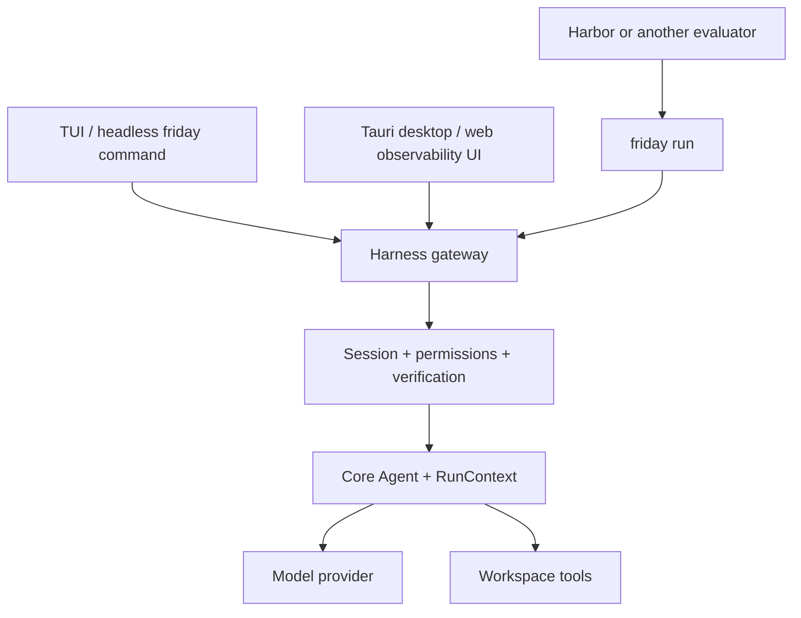

# Architecture

Friday is one TypeScript monorepo with two deliberate runtime boundaries.

## Core

`packages/core` is the reusable unit. `Agent` owns a guarded model → tools →
model loop; `RunContext` owns messages, usage, events, cancellation, and tool
preflight. Provider adapters implement one `ChatModel` contract. The core knows
nothing about settings, sessions, UI, persistence, memory, or Friday prompts.

There is no generic graph API. Friday currently has one execution shape, and
ordinary async control flow is both smaller and easier to inspect. A graph
belongs here only when a second real execution shape proves it necessary.

## Harness

`packages/harness` turns Core into the Friday product. It owns:

- prompt composition and context compaction
- model profiles and provider selection
- workspace, shell, web, memory, skill, and plan tools
- permissions, approvals, and hard denials
- sessions, traces, checkpoints, undo, and recovery
- independent verification and Goal mode
- the NDJSON JSON-RPC gateway

The Harness imports only Core's public API. It does not duplicate the model/tool
loop or let UI state mutate a running agent directly.

## Plugins

Everything outside the core loop is a plugin ([docs](plugins.md)). The
built-in capabilities - the required `workspace` tools, `web`, `memory`, and
`skills` - are plugins Friday ships with; external plugins are the same shape
loaded from `.friday/plugins/` (project) and `~/.friday/plugins/` (user).
One registry assembles them all through the only two seams that exist: the
tool list the loop receives and the system prompt the session composes.
`disabled_plugins` unplugs any non-required capability for real - a disabled
`memory` stops recall and capture, not just its tool. The host enforces the
contract: registered tool names cannot be shadowed, wrappers cannot change a
tool's name or schema, a broken plugin is reported rather than fatal, and
the Goal-mode verifier assembles only from built-in packs' declared
read-only tools.

## Surfaces

TUI and desktop are protocol clients of the same gateway. Desktop releases
compile that gateway into a standalone Bun sidecar; npm installs bundle it next
to the `friday` entry point. Neither client contains a second agent runtime.

## State and concurrency

Session snapshots remain compatible with the `~/.friday` layout used by the
v0.1 Python release, so upgrading does not discard conversations or settings.
That compatibility logic is TypeScript; the repository contains no legacy
Python runtime. A live session owns its Agent, RunContext, approval state, and
cancellation signal. Switching the UI to another conversation does not stop
it. Shared writes are atomic, navigation and settings writes are serialized,
and checkpoints never touch the user's Git index.

## Security boundary

Retrieved files, web pages, tool output, memory, and traces are untrusted data.
Code enforces workspace containment, secret redaction, hard-denied commands,
approval policy, and read-only verifier tools. Bypass mode skips interactive
approval but never the hard-denial layer; it is intended only for isolated
evaluation containers.
